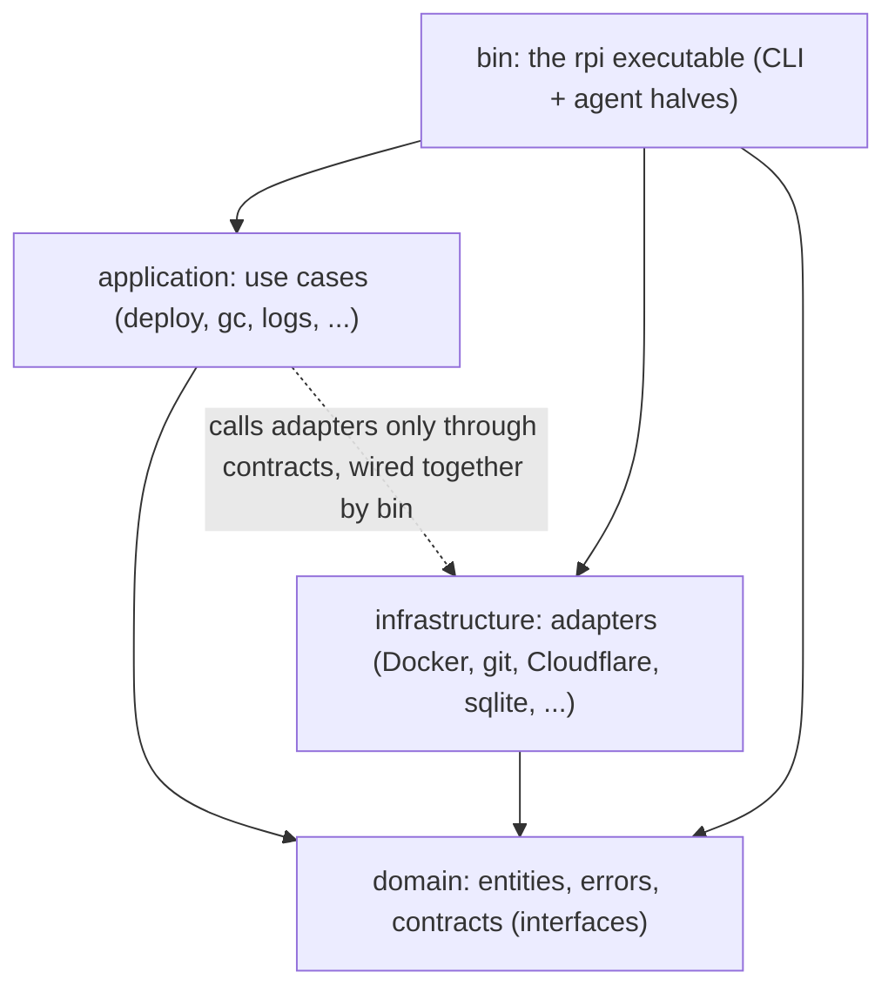
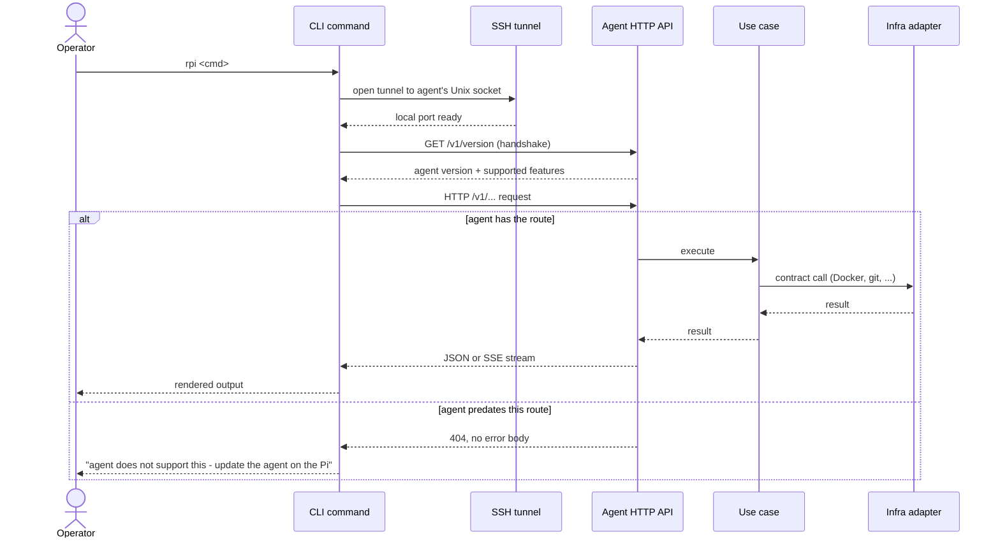

# Workspace Layers and the Request Path

rpi's code is organized into four layers, like an onion: the innermost layer
holds the business rules and doesn't know anything about the layers around
it; each outer layer knows about the layers inside it, never the other way
around. The innermost layer defines a fixed menu of capabilities ("fetch a
project's source code", "run the containers", "store a secret") without
saying which real system provides them; the layer that implements those
capabilities against real systems (Docker, git, a database, Cloudflare) is
kept separate from the layer that uses them to carry out a command such as
`rpi deploy`. The outermost layer is the single `rpi` program itself, which
plays two roles depending on how it's started: an operator-facing command
line, and a background agent that runs on the Raspberry Pi and does the
actual work.

## Walkthrough

1. The four layers only depend inward, matching the flowchart above: `domain`
   depends on nothing else in the workspace; `application` and
   `infrastructure` each depend only on `domain`; `bin` is the outermost
   layer and the only one that depends on all three. A layer never knows
   about the layers around it - `domain` has no idea `application` or
   `infrastructure` exist, and `application`'s code never calls into
   `infrastructure` directly. The only place all four layers meet is `bin`,
   which at startup picks a concrete adapter for each contract
   `domain` defines and hands it to the use case that needs it.
2. The operator runs an `rpi` subcommand. Two commands never leave the
   operator's machine and skip everything below: `rpi init` (writes an
   `rpi.toml` in the current project) and `rpi setup` (saves a named server
   profile locally, for later commands to use). Neither opens a network
   connection to the Pi. (The `rpi agent setup/update/migrate/uninstall`
   family is a separate maintenance surface: it manages the agent itself over
   plain SSH rather than through the request path below.)
3. For every other command, the CLI resolves which server profile to use and
   opens an SSH tunnel that forwards a local TCP port to the agent's Unix
   socket on the Pi.
4. Over that tunnel, before doing anything else, the CLI calls
   `GET /v1/version` on the agent and gets back its version and the list of
   features it supports. This lets the CLI warn up front about version
   mismatches (e.g. "agent is older than the CLI - update the agent on the
   Pi") before attempting the real request.
5. The CLI sends the command's actual request over HTTP to a route under
   `/v1/...` on the agent (for example, `POST /v1/deployments` for
   `rpi deploy`, `GET /v1/projects` for `rpi ls`).
6. The agent's HTTP layer validates the input (e.g. project name shape) and
   calls the matching use case - the piece of application logic that knows
   the steps for that command (the "Deploy" use case, the "List projects"
   use case, and so on).
7. The use case does its job by calling out to one or more adapters, each
   responsible for exactly one outside system (Docker, git, the on-disk
   database, Cloudflare, ...), through a fixed, agreed-upon interface
   (a "contract") rather than knowing how any adapter is actually built.
   This is why the container backend or the secret storage could be swapped
   for a different implementation later without touching any use case, and
   why tests can substitute a fake adapter instead of a real Docker daemon.
8. The adapter does the real work (spawn `docker compose`, run a `git fetch`,
   write a database row, call the Cloudflare API, ...) and returns a result
   up through the use case to the HTTP layer.
9. The agent replies to the CLI either with a plain JSON body (most reads and
   one-shot actions) or, for long-running commands (`rpi deploy`, `rpi logs`,
   running a project command), as a stream of progress events that the CLI
   renders as they arrive.
10. The CLI prints the final, human-readable result to the operator's
    terminal: a table, a one-line confirmation, or a finished log view.
11. Failure branch - **agent lacks the route**: if the agent predates the
    feature a command needs, its HTTP layer never registered that route, so
    the request comes back as a bare 404 with no error body (every real
    rpi-agent error carries a JSON `{"error": ...}` body; a route that
    doesn't exist does not). The CLI recognizes this shape and reports a
    message such as "agent does not support secrets (requires agent >=
    0.9.0) - update the agent on the Pi" instead of a raw HTTP error, so the
    operator knows exactly what to do next.

## Source anchors

- `Cargo.toml` - workspace member list and the crate dependency graph (`bin`
  depends on `application`, `infrastructure`, and `domain`; `application` and
  `infrastructure` each depend only on `domain`).
- `crates/domain/src/lib.rs` - domain crate's module list: `contracts`,
  `entities`, `error`.
- `crates/application/src/lib.rs` - application crate's module list, one
  module per use case (`deploy`, `gc`, `logs`, `command`, `scheduler`, ...).
- `crates/infrastructure/src/lib.rs` - infrastructure crate's module list,
  one module per outside system (`docker`, `git`, `sqlite`, `cloudflare`,
  `secrets`, ...).
- `crates/domain/src/contracts.rs` - every contract (interface) the domain
  layer defines, e.g. `Source` (fetch project code), `ContainerRuntime` (run
  containers), `ProjectRepository` / `DeploymentHistory` (persistence),
  `SecretStore` / `SecretsWriter` (secrets at rest and on disk),
  `HealthGate` (deploy health check), `Ingress` / `CloudflareApi` (routing a
  hostname to the deployment), `StatsProvider` / `SystemProbe` (host and
  service metrics).
