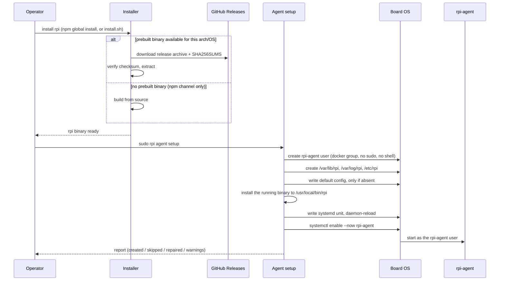

# Agent setup

This explains what happens when an operator puts the `rpi` program onto a
Raspberry Pi (or any Linux + `systemd` board) and turns it into a background
service: how the program first gets onto the board, and what the one-time
bootstrap command does to turn it into a service that survives reboots and
runs without root privileges day to day. See also `flows/agent-update.md` —
`rpi upgrade` reuses the exact same account, directories, and trust boundary
this bootstrap establishes.

## Walkthrough

1. **Getting the binary onto the board.** There are two independent
   installer channels, and both end with the same `rpi` executable on disk.
   The npm channel (`npm install -g rpi-deploy`) runs a postinstall step that
   tries to download a ready-made binary for the package's own version from
   GitHub Releases, matched to the host's OS/CPU; the no-npm channel
   (`curl … install.sh | sh`) does the same download-and-verify recipe in
   plain shell, resolving to the latest published release by default (or a
   pinned version via an environment variable). Both verify the downloaded
   archive against the release's SHA256 checksum file before trusting it,
   and neither channel runs the bootstrap step below automatically — they
   only print the next command to run.
2. **Fallback when there's no prebuilt binary.** The npm channel falls back
   to building from source with `cargo build --release` when the host's
   OS/architecture isn't one of the published prebuilt targets (installing
   Rust via `rustup` first if needed, and checking for a C toolchain). The
   shell installer has no such fallback: an unrecognized `uname -m` is a hard
   failure with no further attempt, because it has no way to build from
   source.
3. **`sudo rpi agent setup` — the one-time bootstrap.** Must run as root
   (via `sudo`). It determines the "login user" — the SSH account the
   operator is actually using — from `--user`, or from `$SUDO_USER` when
   omitted; without either, it refuses to proceed rather than guess.
4. **Creates a dedicated, unprivileged service account.** A system user
   `rpi-agent` is created with no login shell and no home directory, then
   added to the `docker` group (so it can drive Docker Compose) — but never
   to `sudo` or any admin group. The operator's own login user is added to
   the `rpi-agent` group too, so their SSH login can reach the agent's Unix
   socket without needing `sudo` for every command.
5. **Creates the directories the agent owns.** `/var/lib/rpi` (state) and
   `/var/log/rpi` (file logs) are created owned by `rpi-agent`; `/etc/rpi`
   (config) is created owned by root, since the agent only ever reads its
   config, never writes it.
6. **Config adoption, not overwrite.** The default `agent.toml` is written
   only when the file is completely absent — an existing config from a
   previous run (or a hand-edited one) is left untouched. The same rule
   applies to an existing Cloudflare tunnel config (`config.yml`, written
   only by the optional `--with-cloudflared` bootstrap): if one is already
   present, setup adopts and validates it rather than regenerating it.
7. **Installs the binary at the canonical path.** The currently running
   executable is copied atomically (write a temp file, `chmod 0755`, then
   rename it over the target) to `/usr/local/bin/rpi` — the path the
   systemd unit's `ExecStart` always points at, regardless of which
   installer channel produced the binary. Because `sudo` resolves `rpi`
   through root's own `PATH` — which never includes an npm-managed
   directory — setup double-checks: if it finds the binary already sitting
   at the canonical path (so there'd otherwise be nothing to do) but the
   operator's own npm has a `rpi-deploy` install with a different build,
   that build is installed instead, so a newer npm-installed version isn't
   silently ignored.
8. **Writes and enables the systemd unit.** The service definition (running
   as `User=rpi-agent`, `ExecStart=/usr/local/bin/rpi agent run …`) is
   written only if it doesn't already match byte-for-byte; a differing unit
   is backed up to `.bak` first, never dropped. `systemctl daemon-reload`
   then `enable --now rpi-agent` starts (or leaves running) the service.
9. **Cloudflare tunnel, opt-in.** Passing `--with-cloudflared` (with API
   token + domain) additionally installs `cloudflared`, creates or adopts a
   tunnel, and enables it as a per-user systemd service — covered in more
   depth in `flows/ingress.md`; this doc only notes that it exists and
   defaults to off.
10. **Failure branch — Docker missing.** Adding `rpi-agent` to the `docker`
    group fails outright if Docker isn't installed (there's no `docker`
    group to join yet). Setup reports this as an error with a hint to
    install Docker first, and the whole command exits non-zero — though any
    steps already completed (user creation, directories) stay in place, so
    re-running setup after installing Docker picks up cleanly where it left
    off. A second, separate check near the end of setup also warns (without
    failing) if the `docker compose` plugin is missing.
11. **Failure branch — unsupported platform.** Covered in step 2 above: the
    npm channel falls back to a source build; the shell installer fails
    immediately with no fallback.
12. **Re-running setup on an already-configured host.** The whole bootstrap
    is idempotent: an existing user, group membership, directory, or
    identical config/unit file is reported as already present and left
    untouched; only real drift (e.g. a directory owned by a stale UID after
    a reinstall, or a systemd unit whose contents changed) is repaired. The
    binary is only restarted if it was actually replaced by step 7 — running
    setup again with nothing new to install never bounces the service.
13. **Privilege split, end to end.** Root is only ever needed for this
    bootstrap command itself — creating the account, directories, and
    systemd unit, and installing the binary at a root-owned path. From the
    moment the unit starts, the agent process itself runs entirely as the
    unprivileged `rpi-agent` user, with no `sudo` access, for the rest of
    its life until the next bootstrap or update.

## Source anchors

- `crates/bin/src/agent/setup.rs` — the idempotent bootstrap itself: service
  account, directories, config adoption, systemd unit write-with-backup,
  binary self-install trigger, and the optional Cloudflare tunnel bootstrap.
- `crates/bin/src/agent/self_install.rs` — atomic copy of the running binary
  onto the canonical `/usr/local/bin/rpi` path (temp file, chmod, rename).
- `scripts/install.sh` — no-npm one-line installer: arch detection, checksum
  verification, install; no source-build fallback.
- `scripts/postinstall.js` — npm postinstall: prebuilt-binary download with
  checksum verification, falling back to a `cargo build --release` source
  build when no prebuilt binary matches the host.
- `bin/rpi.js` — the `rpi` shim npm installs on `PATH`; simply execs the
  binary `postinstall.js` placed under the package's `dist/` directory.
