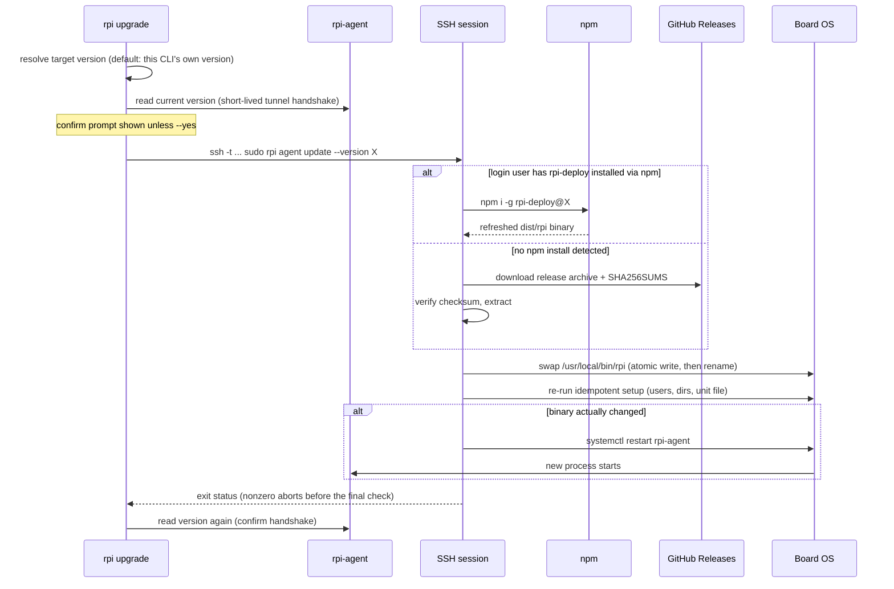

# Agent update

This explains what happens when an operator runs `rpi upgrade` from their own
machine to bring a board's agent up to a chosen version, without ever
touching the board by hand. See also `flows/agent-setup.md` — update reuses
the exact same account, directories, and systemd unit that the one-time
bootstrap already created; it never creates anything new.

## Walkthrough

1. **Resolve the target version, on the client.** With no `--version` flag,
   the target defaults to the CLI's own version — "bring the board up to the
   version of `rpi` I'm running" — which is what keeps the client and agent
   compatible. `--version latest` resolves the newest published release via
   the GitHub API instead; an explicit `--version X` is used as-is. Either
   way, the value is restricted to characters a real version number uses
   before it's ever sent anywhere, since it will be interpolated into a
   remote shell command.
2. **Show current vs. target, then confirm.** The client opens a short-lived
   SSH tunnel to read the board's currently running version (the same
   handshake an ordinary command uses to connect), prints `current -> target`,
   and prompts for confirmation — skipped with `--yes`.
3. **The privileged work happens over a fresh SSH session, not through the
   agent.** The client runs `ssh -t <user>@<host> sudo rpi agent update
   --version X` — a one-shot invocation of the *same* `rpi` binary, executed
   as root on the board, with its own terminal so `sudo` can prompt if
   needed. This is deliberate: the long-running `rpi-agent` process is
   unprivileged by design (docker group only, no `sudo`) and has no code
   path to replace its own binary or restart its own service — it is never
   asked to. The update is carried out entirely by this separate, privileged,
   short-lived process instead.
4. **Board-side: obtain the new binary.** `agent update` picks one of two
   channels, mirroring `agent setup`'s own self-install logic: if the SSH
   login user has `rpi-deploy` installed via their own npm, it refreshes
   that install (`npm i -g rpi-deploy@X`) and uses the resulting `dist/rpi`;
   otherwise it downloads the matching release archive plus its `SHA256SUMS`
   file from GitHub directly, verifies the checksum, and extracts it to a
   temporary working directory. (Run directly on the board with no
   `--version`, it resolves the latest release itself; `rpi upgrade` always
   passes an explicit version, so that path isn't exercised through the
   client.)
5. **Board-side: apply through the same path as setup.** The obtained binary
   is swapped into `/usr/local/bin/rpi` with the identical atomic
   write-then-rename used by first-time setup, then the idempotent bootstrap
   is re-run (so any drift in the account, directories, or unit file is
   repaired the same way `agent setup` would repair it — no new resources
   are created on a healthy host). Only if the binary actually changed does
   it restart the `rpi-agent` systemd unit to load the new build.
6. **The trust root is unchanged from a first install.** SSH access plus
   `sudo` on the board is the same privilege boundary `agent setup` already
   relies on; binary integrity still rests on GitHub's TLS and the release
   `SHA256SUMS` file (GitHub-direct channel) or on npm's own integrity
   checking (npm channel). No new secret or trust anchor is introduced for
   updates.
7. **Verify, after the SSH session returns.** Once the remote command exits
   successfully, the client reconnects and reads the board's version again,
   reporting success when it matches the target.
8. **Failure branch — checksum mismatch or no release asset for that
   version.** Either failure happens entirely on the board, before anything
   is touched: a corrupted or tampered download fails its SHA256 check, and
   a version/architecture combination with no matching release asset fails
   the download itself. In both cases `agent update` exits non-zero without
   ever swapping the binary, the SSH session exits non-zero in turn, and
   `rpi upgrade` reports the failure immediately — it does not attempt the
   final version check at all, since nothing was applied.
9. **Failure branch — agent doesn't come back after the restart.** This is
   different from the previous branch: here, the board-side command
   succeeds (binary swapped, bootstrap re-run cleanly, restart issued) and
   exits zero, so the SSH session reports success and the client proceeds to
   the final check. If the new build fails to start (or is slow to), that
   final version read can't reach the agent, and the client reports "could
   not read the board version after update" rather than a success — leaving
   the operator to check the board directly (`rpi agent logs`, `systemctl
   status rpi-agent`) rather than pretending the update completed cleanly.
   A related, milder case: if the agent comes back but the version it
   reports doesn't match the target, the client warns instead of reporting
   success, noting a restart may still be pending.

## Source anchors

- `crates/bin/src/agent/update.rs` — board-side `agent update`: resolves the
  version, picks the npm vs. GitHub-direct channel, and drives the
  swap/re-setup/restart sequence.
- `crates/bin/src/agent/release.rs` — the GitHub-direct channel's mechanics:
  latest-version lookup, architecture-to-asset mapping, archive + checksum
  download, and SHA256 verification.
- `crates/bin/src/cli/upgrade.rs` — client-side `rpi upgrade`: target version
  resolution, the before/after version handshake, and the `ssh -t … sudo rpi
  agent update` invocation.

