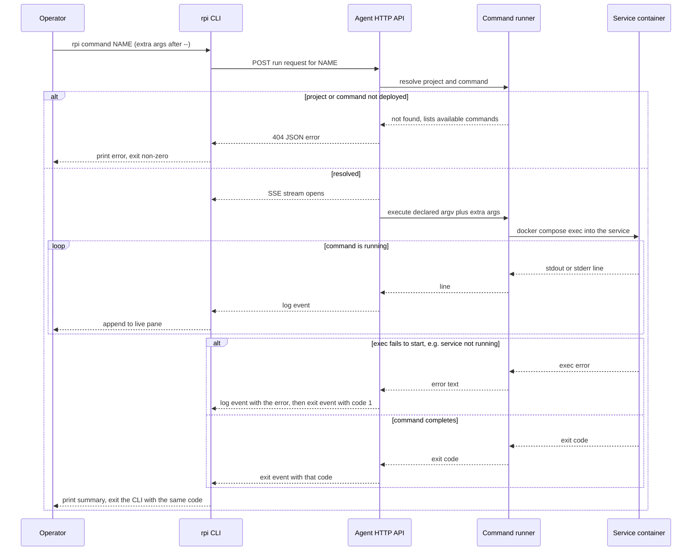

# Commands: running a declared script inside the project container

`rpi command` runs a script that a project's own configuration already
declared, executing it inside that project's running container instead of on
the operator's machine. It exists for operational one-off tasks — seeding a
database, sending an invite, running a migration — without opening a shell on
the Pi. Only scripts that were explicitly declared and deployed can run this
way; there is no way to pass an arbitrary shell command through this path.

## Walkthrough

1. **Declaring a command.** A project's `rpi.toml` can declare a `[commands]`
   table: each entry names a command and gives it an argv, optionally pinned
   to a Compose service other than the project's main one. These
   declarations only take effect once deployed — `rpi deploy` uploads them to
   the agent, which stores them as part of that project's deployed
   configuration. The CLI's local `rpi.toml` is never trusted as the ground
   truth for what can actually run; it only powers a "you declared this but
   never deployed it" hint.
2. **Listing deployed commands.** `rpi command` with no name asks the agent
   what is actually deployed for that project and prints each one with its
   argv (and pinned service, if any). It separately warns if the local
   `rpi.toml` declares a command name the agent doesn't have yet, pointing at
   `rpi deploy`.
3. **Sending a run request.** `rpi command NAME` (with any trailing
   arguments written after `--`) sends the name and those extra arguments to
   the agent over the tunnel that was already opened and version-checked for
   this session (see `flows/connect.md` for that handshake and its own
   feature-gating, which also covers an agent too old to run commands at
   all).
4. **Resolving before streaming.** The agent looks the project up, then
   looks the command name up in that project's deployed `[commands]`. Both
   checks happen — and can fail — before the response stream ever opens, so
   a bad project or command name comes back as one ordinary JSON error, not
   a stream that starts and then breaks.
5. **Executing inside the container.** Once resolved, the agent builds the
   final argv (the declared argv plus any trailing arguments from the
   command line) and runs it with `docker compose exec`, inside the pinned
   service if the command specifies one, otherwise the project's main
   service — using the same Compose file, working directory, and deployed
   override file the project's regular deploy uses. The run is bounded by a
   time budget (ten minutes, unless the project sets its own override); a
   run that hangs past that budget is killed and reported as a timeout, the
   same way a stuck deploy stage would be.
6. **Streaming output.** stdout/stderr lines from the exec are pushed onto
   the response as an event stream as they're produced, and the CLI renders
   them into a live pane on the terminal as they arrive.
7. **Finishing.** The last thing on the stream is the in-container exit
   code. The CLI mirrors it exactly: exit 0 prints a short success summary
   (or the full buffered output with `--full`); the CLI process itself then
   exits with that same code, so `rpi command` can be chained in scripts and
   its exit status trusted like any other tool's.

### Failure branches

- **Unknown command name.** The agent's not-found response lists the
  command names that actually are deployed for that project (or, if none are
  deployed at all, points at declaring `[commands]` and redeploying); the CLI
  prints it and exits non-zero without ever opening the event stream.
- **Service not running (or the exec otherwise fails to start).** Rather
  than aborting the stream outright, the runtime's own error becomes one more
  log line ("error: …"), and the run is then reported as exit code 1 — from
  the operator's side this looks exactly like the command itself failing.
- **Non-zero exit.** Whatever code the process inside the container
  returned is not a transport error — the request itself still succeeded —
  it is data the CLI chooses to treat as this run's failure, print, and
  propagate as its own process exit code.
- **Other interruptions.** A run that exceeds its time budget is killed and
  reported as a timeout instead of an exit code. If the operator kills the
  CLI (or the tunnel drops) before the stream ends, the agent notices the
  response has gone away, aborts the in-flight task, and drops the exec
  future — killing the underlying `docker compose exec` process on a
  best-effort basis (a process that exec itself spawned inside the container
  may still outlive it).

## Source anchors

- `crates/application/src/command.rs` — the `RunCommand` use case: resolves
  the project and its deployed command (allowlist only, never an arbitrary
  argv), builds the exec target (service, Compose file, override file,
  workdir), enforces the run's time budget, and returns the in-container
  exit code.
- `crates/bin/src/cli/sse.rs` — the client-side parser that turns the raw
  `event:`/`data:` text of the HTTP response into discrete events; this is
  what the CLI uses to read the "log" and "exit" events this flow streams
  back (the same parser backs every other event-stream endpoint in this
  codebase).
