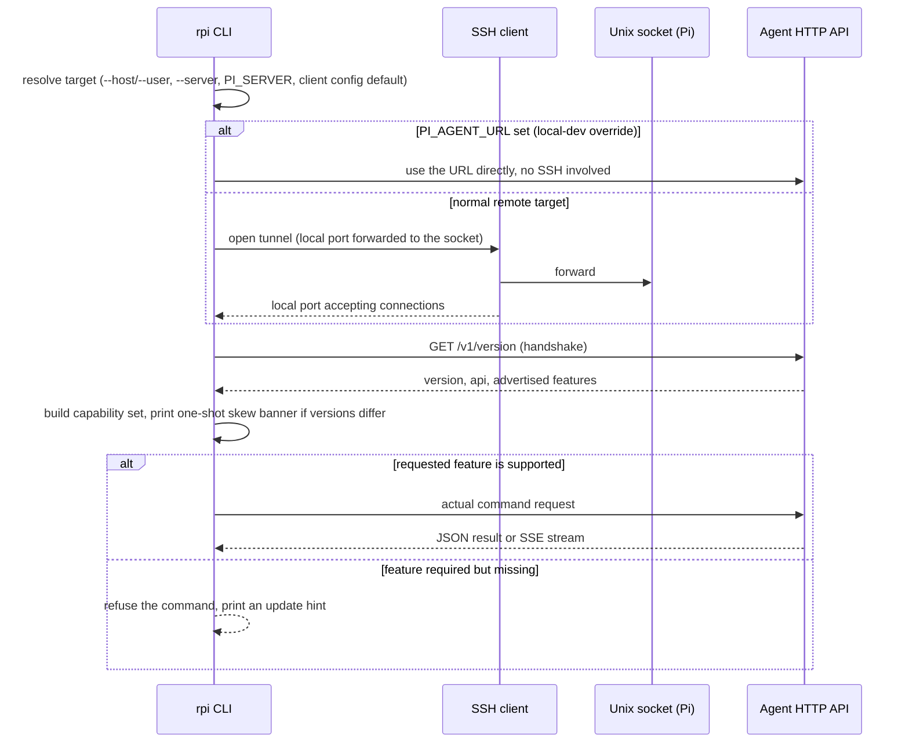

# Connect: reaching the agent and checking compatibility

Every `rpi` command that talks to a live Pi first has to answer three
questions: which Pi, how to reach it without the Pi exposing anything to the
open network, and whether the CLI and the agent on the other end speak the
same version of the protocol. This document explains how the CLI picks a
target, how the SSH tunnel takes the place of a network port that never
exists, what the two sides tell each other the instant they connect, and what
a user sees when either side turns out to be too old to understand the
other.

## Walkthrough

1. **Resolve target.** If both a direct host and user are given on the
   command line, the CLI builds the connection straight from those flags
   (optionally with a key path) and never reads any config file — this is
   the CI-friendly path. Otherwise it reads the user's client config file
   and picks a named profile in this order: an explicit profile flag, then
   the `PI_SERVER` environment variable, then the config's declared default,
   then — only if the config defines exactly one profile — that lone entry.
   If none of these resolve, or a named profile isn't found in the config,
   the CLI stops with an error before attempting any network activity.

2. **Open the tunnel, and why a socket instead of a port.** The agent's HTTP
   API is bound to a Unix domain socket on the Pi, never to a TCP port —
   there is nothing on the Pi's network interface for the API itself except
   the SSH server the operator already has credentials for. To reach the
   socket, the CLI spawns an SSH client that forwards a local, ephemeral TCP
   port on the operator's machine onto that remote socket, then waits (with
   a bounded budget) until that local port starts accepting connections
   before treating the tunnel as ready.

3. **Local-dev bypass.** If an environment variable pointing at an already-
   reachable agent URL is set, the CLI skips SSH and the socket entirely and
   talks to that URL directly instead, for whichever command is running.
   This exists for local development and end-to-end test setups where the
   "agent" already sits on a reachable port with no SSH hop needed; it is
   not something a normal deployment against a real Pi sets.

4. **Handshake.** Once a base URL exists (tunnel or direct), the CLI issues
   one request to the agent's version endpoint before doing anything else.
   The response carries the agent's own version string, the API generation
   it serves, and — on agents new enough to advertise it — the explicit list
   of capability strings that agent supports. Agents that predate this
   explicit list are handled by inferring their capabilities from a frozen
   table keyed by version number, so old agents are never silently assumed
   to support features they can't serve.

5. **Version-skew banner.** Comparing the two version strings, the CLI
   prints at most one warning per run: if the agent is older, it points at
   updating the agent; if the agent is newer, it points at updating the CLI
   instead; any other mismatch it can't characterize confidently (an
   unparseable version string, or two strings that parse to the same
   number but aren't textually identical) gets the same generic "update the
   agent" wording. Identical version strings produce no banner at all.

6. **Feature gating.** Before a command that depends on a particular
   capability (for example, secrets, container commands, or stats) actually
   calls its endpoint, the CLI checks that capability against the set
   negotiated in the handshake. A required-but-missing capability stops the
   command immediately with a message naming the feature, the minimum agent
   version that introduced it, and which side needs updating — this is
   deliberate: it replaces what would otherwise be a confusing low-level
   HTTP error with a plain instruction. Some capabilities are allowed to be
   missing quietly instead (the CLI just skips that step and falls back to
   older behavior), which is how a deploy-key preflight check degrades
   gracefully against an agent that doesn't support it yet.

7. **The actual request, and a race safety net.** Once gating clears, the
   CLI sends the real request over the same tunnel. Because the running
   agent could in principle have been swapped between the handshake and this
   call, the client treats an unexpected 404 specially: a 404 carrying a
   normal JSON error body is a legitimate "not found" from the agent's
   business logic and is shown to the user as-is, while a completely bare
   404 (no body at all) means the route itself doesn't exist on the running
   agent — the client turns that into the same feature-unavailable message
   the gate check would have produced, rather than a raw HTTP error.

8. **A second, simpler path: direct SSH execution.** A handful of commands
   never go through the tunnel or the HTTP API at all — provisioning a Pi
   for the first time, replacing the agent binary during an update, and the
   raw connectivity check behind the diagnostics command all run a command
   directly over SSH instead, because in each of those cases there may be no
   agent listening yet, or the agent binary itself is the thing being
   replaced. This direct-execution path shares the same resolved target and
   key as the tunnel path, just without the port-forward or the HTTP layer
   on top.

### Failure branches

- **SSH refused or unreachable.** Whether the cause is a wrong host, a
  blocked port, or a rejected key, the CLI can't tell the difference: if the
  local forwarded port never starts accepting connections within its
  budget, the tunnel setup fails with one message telling the user to check
  their SSH access to the Pi.
- **Socket missing (agent not running).** Login over SSH can work perfectly
  while the forward still fails, because there is nothing listening on the
  remote socket path — for example, the agent service was never started or
  it crashed. The CLI's tunnel setup does not distinguish this from an SSH
  refusal: either way, the local end of the tunnel never comes up within its
  budget, and the user sees the same "check SSH access to the Pi" message.
  Telling the two apart requires a separate, plain-SSH check of the agent's
  service status rather than anything the tunnel step itself reports.
- **Bare 404 from an old agent, at the handshake itself.** If the version
  endpoint doesn't exist at all — an agent from before the API even had a
  version namespace — the handshake fails immediately with a message
  saying the agent is incompatible and needs updating, before any
  feature-level gating ever runs. This is the coarsest possible skew and is
  caught earliest.
- **Bare 404 from an old agent, on a specific feature.** Covered in step 7
  above: a route that simply isn't registered on the running agent produces
  the same clear "feature unavailable, update the agent" message as a
  failed gate check would have, whether the mismatch was caught by the
  handshake or only shows up when the real request lands.

## Source anchors

- `crates/bin/src/cli/config.rs` — client config file, profile selection
  order (`--server` / `PI_SERVER` / default / sole profile), and the direct
  `--host`/`--user`/`--key` bypass.
- `crates/bin/src/cli/connect.rs` — the single entry point every
  agent-talking command goes through: resolve target, open tunnel, run the
  handshake, emit skew banners.
- `crates/bin/src/cli/ssh.rs` — direct SSH command execution, used by
  provisioning, agent updates, and the raw connectivity check, separate
  from the tunnel path.
- `crates/bin/src/cli/tunnel.rs` — the SSH port-forward onto the agent's
  Unix socket, the local-dev URL bypass, and the tunnel-readiness timeout.
- `crates/bin/src/cli/api.rs` — HTTP client for the agent API: error-body
  extraction and the bare-404-vs-JSON-404 distinction that reveals an old
  agent.
- `crates/bin/src/compat.rs` — the version handshake's capability model,
  feature gating policies, and the version-skew banner logic.
