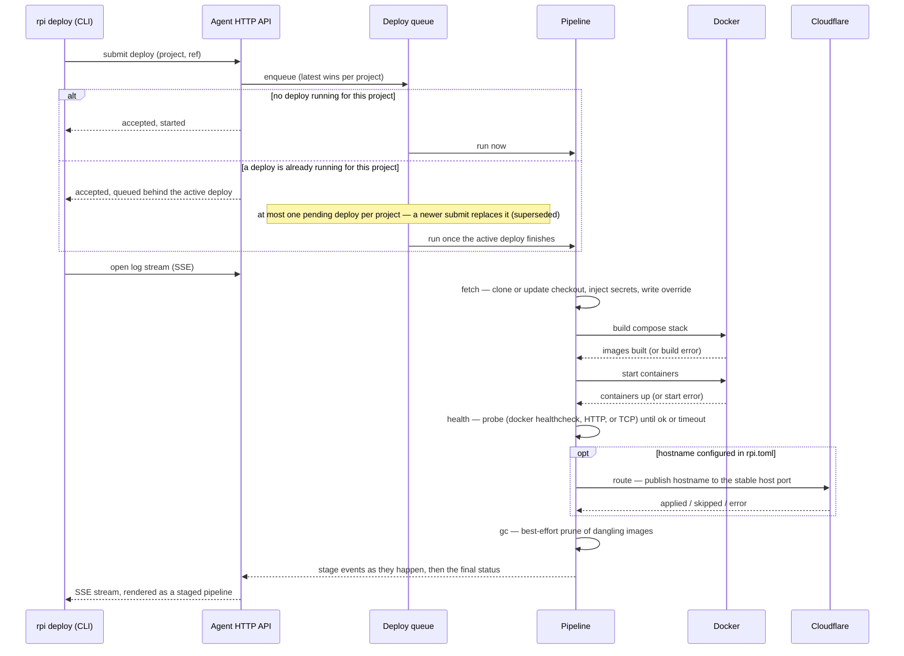
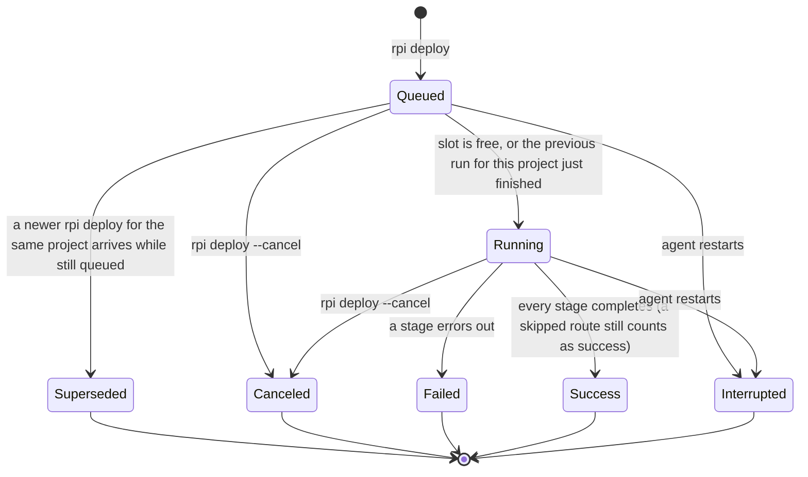

# Deploy pipeline and queue

Running `rpi deploy` moves a project's code from its git repository to a
running, publicly reachable service on the agent host. The agent runs a fixed
sequence of stages — fetch the code, build the images, start the containers,
wait for the service to become healthy, publish its public hostname if one is
configured, and clean up old build artifacts — and streams progress back to
the CLI in real time. Only one deploy runs at a time per project; anything
else submitted while it's running waits in a one-slot queue, and if a second
request arrives while a third is still waiting, the newest request simply
replaces the waiting one ("latest wins") instead of piling up a backlog.

## Walkthrough

1. `rpi deploy` reads `rpi.toml` in the current directory, connects to the
   agent, and — when the agent supports it — checks that it can reach the git
   remote before submitting anything.
2. The CLI submits the deploy request over the agent's HTTP API. The agent
   answers immediately with a deployment id and whether the deploy started
   right away or was queued behind another one.
3. Queuing is per project and latest-wins: at most one deploy waits behind
   the one that's currently running. If a second request arrives while the
   first is running, it waits. If a third request arrives while the second
   is still waiting, the third replaces the second outright — the second is
   marked superseded and never runs at all; the CLI watching it sees its
   stream end immediately with a "superseded" result. The deploy that is
   already running is never affected by newer submissions — only the one
   still waiting can be replaced.
4. Once a deploy starts running, the CLI opens a log stream and renders every
   stage as it happens: a staged pipeline where each stage shows started,
   then succeeded / failed / skipped, with timing. The agent buffers each
   deployment's recent log lines and stage events — an in-memory backlog
   while it's still running, or the tail saved with its history record once
   it's finished — and replays that backlog to any viewer who opens or
   reopens the deploy's log stream, with live events (or just the final
   status, for an already-finished deploy) following right after.
5. **Fetch** — clones the repository on the very first deploy of a project
   (generating a dedicated SSH deploy key first if the repo needs one), then
   always fetches from the remote and hard-resets the checkout to the
   requested branch or commit. Secrets are then decrypted and written into
   the checkout, and rpi's own compose override (fixed host port, bind
   address, restart policy) is generated.
   - *Failure*: a git error, or the fetch stage exceeding its timeout, fails
     the deploy right here. Nothing has been built or started, so whatever
     was already running from a previous deploy is untouched.
6. **Build** — runs `docker compose build` against the fetched checkout.
   Builds across different projects share a limited, agent-wide pool of
   build slots, so the Pi never builds many projects' images at once.
   - *Failure*: a bad Dockerfile, a failed dependency fetch, or a build
     timeout fails the deploy here. Because `start` never runs, whatever was
     already running from the previous successful deploy of this project
     keeps running untouched.
7. **Start** — runs `docker compose up -d --remove-orphans` to bring up (or
   replace) the running stack, using the fetched compose file plus rpi's
   override.
   - *Failure*: a compose error or timeout fails the deploy here. Health and
     route never run; the containers are left exactly as Docker's own `up`
     left them — there is no automatic rollback.
8. **Health** — polls the public service until it passes: a Docker-declared
   healthcheck if the service has one, otherwise an HTTP GET on the
   configured health path, otherwise a plain TCP connect — up to the
   project's health timeout.
   - *Failure*: the gate times out, or Docker reports the container
     unhealthy. The deploy fails here, but the stack `start` just brought up
     is deliberately left running rather than torn down, so it stays
     reachable and debuggable instead of disappearing.
9. The agent also queries the running service count for the CLI's final
   summary (silently skipped if that query fails), and, for projects exposed
   on the LAN, logs a best-effort reachable `http://<lan-ip>:<port>` line
   (with a warning if the detected address turns out to be public rather
   than a private LAN address).
10. **Route** — only runs when `rpi.toml` declares a hostname. Publishes (or
    updates) the Cloudflare route pointing at the project's stable host
    port.
    - *Failure branches*: if ingress is disabled on the agent, the stage is
      marked **skipped**, not failed — the deploy still succeeds, and the
      CLI prints a warning telling the operator how to enable ingress. If
      the route call itself errors, the deploy **fails** here; the
      application stack is already up and healthy at this point, just not
      reachable at its public hostname.
11. **Gc** — a best-effort prune of dangling Docker images to reclaim disk
    space. A gc error, or its own timeout, is always downgraded to
    "skipped" — it never fails the deploy.
12. The agent records the final status (success, failed, or canceled) and
    closes the stream. The CLI prints a final stamp (success / superseded /
    failed) with elapsed time, service count, and hostname if any, and
    re-prints any warnings (like the ingress-disabled one) next to it so
    they can't scroll away unseen. A failed deploy makes the CLI exit
    non-zero.
13. **Canceling** (`rpi deploy --cancel`) cancels every active deployment for
    the project at once, not just one: a deploy still waiting in the queue
    is removed and marked canceled before it ever runs; a deploy that's
    already running is signaled to stop wherever it currently is (killing
    any in-flight git/docker command it was waiting on) and is then marked
    canceled. Either way, canceling never tears down or rolls back
    containers that `start` already brought up — it only stops the pipeline
    from proceeding any further. The CLI has no distinct stamp for this
    outcome, though: whichever process is still following that deploy's log
    stream sees a status other than success or superseded, so an explicit
    `--cancel` still prints the same failed-style stamp and exits non-zero,
    just like a genuine failure.
14. When a running deploy ends — success, failure, or cancellation — the
    agent immediately promotes the one deploy waiting behind it (if any) to
    running. If nothing is queued, the project goes idle until the next
    `rpi deploy`.
15. If the agent process itself restarts while a deployment is still queued
    or running, that row is not resumed: every such deployment is marked
    interrupted at startup, and the project simply waits for the next
    `rpi deploy` to start fresh.

## Source anchors

- `crates/application/src/deploy.rs` — the deploy use case: runs fetch →
  build → start → health → route → gc in order, emits the stage/log events
  the CLI renders, and records the final status.
- `crates/application/src/scheduler.rs` — the per-project deploy queue:
  starts a deploy immediately if the project is idle, otherwise queues it; a
  newer queued request supersedes the one waiting; drives cancel and
  promotes the next queued deploy once the running one finishes.
- `crates/infrastructure/src/git.rs` — the fetch stage: clones or updates
  the checkout, generates a per-project SSH deploy key when the repo needs
  one, and checks repo access ahead of a deploy.
- `crates/infrastructure/src/repo.rs` — stores each project's configuration
  and allocates its host port on first deploy; the port stays stable across
  every later redeploy of that project.
- `crates/infrastructure/src/docker.rs` — runs `docker compose build` and
  `docker compose up -d` for the build and start stages (it also backs
  other, non-deploy commands not covered by this document).
- `crates/infrastructure/src/health.rs` — the health stage: tries a
  Docker-declared healthcheck first, then an HTTP probe, then a plain TCP
  connect, polling until one passes or the timeout expires.
- `crates/infrastructure/src/probe.rs` — the agent's diagnostics (`rpi
  doctor`): checks Docker/compose availability and ingress configuration.
  Read for contrast — it does not participate in the deploy pipeline
  itself.
- `crates/infrastructure/src/hostnet.rs` — best-effort local network
  address detection, used only to log a reachable LAN URL for
  LAN-exposed projects; it does not allocate or manage ports (that's
  `repo.rs`).
- `crates/infrastructure/src/overrides.rs` — writes rpi's own compose
  override (bind address, stable host port, restart policy) that the
  build/start stages layer on top of the project's own compose file.
- `crates/infrastructure/src/history.rs` (`sweep_interrupted` only) — marks
  any deployment left `queued` or `running` as `interrupted` when the agent
  restarts; its other role, deployment-history retention, is covered in
  `flows/gc.md`.
- `crates/infrastructure/src/events.rs` — the in-memory backlog and live
  broadcast behind the deploy log stream: buffers each running deployment's
  recent events and replays them to a viewer that opens or reopens the
  stream mid-run.
- `crates/application/src/tail.rs` — keeps the last N lines of a
  deployment's log as its history record's tail, which is what a viewer
  gets instead once that deployment has finished.
- `crates/bin/src/cli/commands.rs` — the CLI side of `rpi deploy` and `rpi
  deploy --cancel`: submits the request, follows the SSE stream, renders
  the staged pipeline, and prints the final result.
- `crates/bin/src/cli/sourcekey.rs` — the deploy-key preflight run before
  submitting a deploy for an SSH-remote repo: asks the agent whether it can
  read the repo, and on denial either auto-registers a deploy key via the
  local `gh` CLI or shows the public key with instructions and polls until
  access works.
