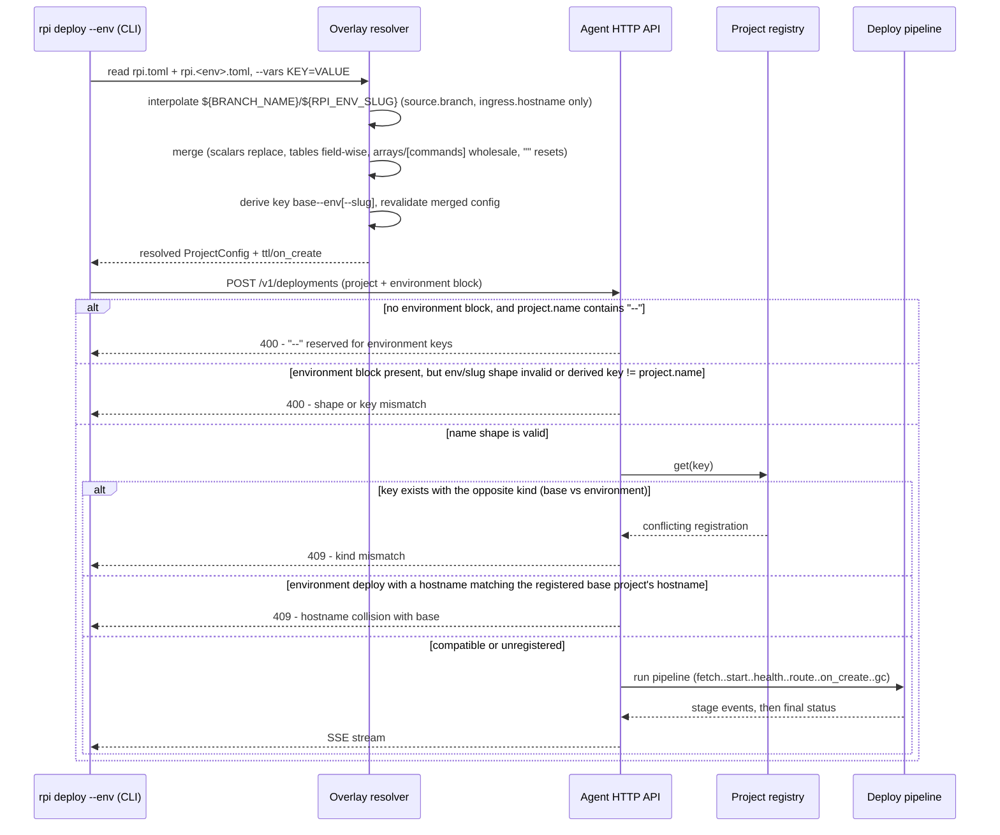
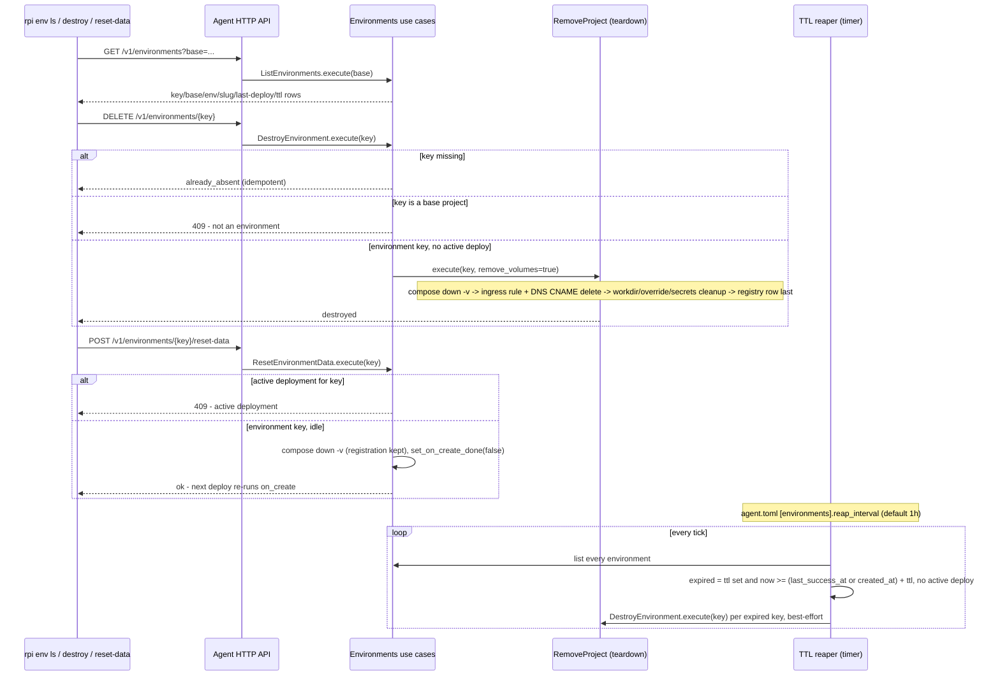

# Environment overlays

An environment overlay lets one project deploy to more than just its single
production key: a shared `test` environment, or an ephemeral per-branch
preview, built from the same repository and mostly the same `rpi.toml`. This
document covers the whole path: how the CLI computes an environment's merged
configuration and derived key from an overlay file, how the agent tells an
environment deploy apart from a plain one, the one extra one-time stage the
deploy pipeline runs for environments, how a deployed environment is listed,
destroyed, or reset, and how an environment with a TTL is torn down on its
own once it expires. See `flows/deploy.md` for the deploy pipeline both kinds
of project share, and `flows/ingress.md` for the Cloudflare route/DNS
teardown an environment destroy also goes through.

## Walkthrough

1. `rpi deploy --env <env> [--vars KEY=VALUE ...]` — and, identically,
   `rpi command`, `rpi secrets send`, `rpi secrets ls`, and
   `rpi config show`, all of which accept the same `--env`/`--vars` pair —
   resolves `./rpi.toml` plus `./rpi.<env>.toml` entirely locally, before the
   agent is ever contacted.
   - *Failure*: no `rpi.<env>.toml` next to `rpi.toml` fails with an error
     that lists whichever `rpi.*.toml` files it did find in the directory.
     `<env>` itself must match `^[a-z][a-z0-9-]*$` and must not be one of the
     names reserved for `rpi env`/`rpi config` subcommands (`show`, `ls`,
     `destroy`, `reset-data`).
2. `${VAR}` interpolation is allowed only inside `source.branch` and
   `ingress.hostname` — a `${...}` anywhere else in the overlay (including
   inside `[commands]`, an argv array, or the command table's `service`
   field) is a hard parse error naming the field. `${RPI_ENV_SLUG}` is
   derived from `--vars BRANCH_NAME=<branch>` only when the overlay actually
   references it, by lower-casing the branch name, collapsing every run of
   characters outside `[a-z0-9]` to one `-`, truncating to 30 characters, and
   trimming a trailing `-`; a branch name that normalizes to nothing is an
   error. An overlay that turns out not to reference any variable rejects
   `--vars` outright ("not parameterized ... remove --vars"), and a
   parameterized overlay used without `--vars BRANCH_NAME=...` is likewise an
   error.
3. The overlay merges onto the base configuration field by field: scalars
   replace, nested tables merge field-wise (only the fields actually present
   in the overlay change), `[commands]` and array fields (`secrets.files`)
   replace wholesale rather than merge, and an explicit empty string (`""`)
   resets an optional field to unset instead of being treated as a normal
   value.
4. The merged, revalidated configuration's `project.name` is overwritten
   with the derived key: `<base>--<env>` for a static overlay, or
   `<base>--<env>--<slug>` once `${RPI_ENV_SLUG}` was actually substituted
   somewhere. The overlay's own `[environment]` section (`ttl`, `on_create`)
   is pulled out separately rather than merged into the deployed config; if
   `on_create` is set, it must name a command that survives in the merged
   `[commands]` table (which the overlay may itself have replaced wholesale),
   or resolution fails right here, before any agent contact.
   - *Failure*: `validate_common` now also rejects a merged `[ingress]
     .hostname` that isn't a well-formed DNS name (RFC-1123-style: label
     length, charset, no leading/trailing `-`) — this catches a raw
     `${BRANCH_NAME}` substituted straight into the hostname (a `/` in a
     branch name like `feature/login` is invalid DNS), which is why
     `${RPI_ENV_SLUG}` is the variable meant for that field. Separately, if
     the merged hostname is present and equals the *base* file's hostname —
     whether inherited from an overlay with no `[ingress]` at all, or set
     explicitly to the same string — resolution fails right here: an
     environment must override the hostname to something else or clear it
     with `hostname = ""`. Without this check, the environment's first
     successful deploy would re-route the production hostname to the
     environment's own host port.
5. `rpi config show [--env <env>] [--vars ...]` runs this exact resolution
   and prints the merged TOML — plus a synthetic `[environment]` block when
   one was selected — without contacting the agent at all; it's the way to
   check what a deploy would actually send.
6. `rpi deploy --env <env>` sends the resolved `ProjectConfig` (its
   `project.name` already the derived key) alongside an `environment` block
   (`env`, `base`, `slug`, `ttl_secs`, `on_create`) in the same
   `POST /v1/deployments` request a plain deploy uses. Before sending it, the
   CLI checks the agent advertises the `environments` feature (agent
   `>= 0.24.0`) and refuses locally with an upgrade message if it's talking
   to an older agent.
7. The agent validates shape before ever touching the registry. A request
   with **no** `environment` block whose `project.name` contains `--` is
   rejected 400 immediately — `--` is reserved for derived keys — which is
   why a plain, non-overlay deploy can never even reach the
   already-registered-as-an-environment check below. A request **with** an
   `environment` block is checked for name-part shape (`base`/`env`/`slug`
   charset, no `--`, no leading/trailing `-`) and that
   `base--env[--slug]` matches `project.name` exactly; either failure is also
   400, still before the registry is consulted.
8. Only once shape validation passes does the agent look the key up in the
   registry. If it already exists under the opposite kind — a plain deploy
   aimed at a key that's registered with environment metadata, or an
   environment deploy aimed at a key registered as a base project — the
   agent answers 409. Because step 7 already rejects every `--`-bearing name
   on a plain deploy, this 409 in practice only fires for a key that passes
   plain-deploy name validation (no `--`) yet is *already* registered as an
   environment — for example a registry row seeded by a version that
   predates this validation, not something a current CLI can produce on
   either side by accident. Right after that, for an environment deploy that
   carries a hostname, the agent looks up the registered *base* project (by
   `environment.base`, not the derived key) and answers 409 if its hostname
   matches — the same production-key protection as step 4's resolve-time
   check, but covering a stale or hand-crafted CLI that skips it.
9. From here the deploy pipeline (`flows/deploy.md`) runs unchanged through
   fetch, build, start, health, and the optional route stage. Right after
   that point — whether or not a hostname triggered an actual route — an
   environment deploy whose overlay set `on_create` and whose registry row
   still has `on_create_done = false` runs one extra stage: `on_create` execs
   that command inside its declared service (or the project's default
   service), exactly once per key.
   - *Failure*: a nonzero exit code, or an `on_create` name no longer
     present in the merged `[commands]` (a defensive re-check — the CLI
     already validated this at resolve time in step 4), fails the deploy at
     the `on_create` stage; `on_create_done` is left `false`, so the very
     next deploy of the same key retries it.
   - *Success*: `on_create_done` flips to `true` and the command never runs
     again for that key, across any number of future redeploys — only
     `rpi env reset-data` clears the flag back to `false`.
10. `gc` runs last, exactly as in a plain deploy.
11. The registry (`repo.rs`) persists `env_name`/`env_base`/`env_slug`/
    `env_ttl_secs`/`env_on_create`/`env_on_create_done` alongside the
    existing project row; `env_name IS NOT NULL` is what makes a row "an
    environment" for every guard and query in this document, and a
    redeploy's `UPDATE` never touches `env_on_create_done` — only
    `set_on_create_done` does. `mark_deploy_success` stamps
    `last_success_at` on every successful deploy, environment or not; the
    reaper (step 14) reads that same timestamp.
12. `rpi env ls [--all]` calls `GET /v1/environments[?base=<project>]`.
    Without `--all`, the CLI first resolves the current directory's own
    `rpi.toml` (no overlay) to get its `base` name and passes that as the
    filter; `--all`, or running outside any project directory, lists every
    environment on the agent instead. Only rows with `env_name` set are ever
    returned.
13. `rpi env destroy <env> [--vars ...]` and `rpi env reset-data <env>
    [--vars ...]` both first run the exact same local overlay resolution
    `rpi deploy` uses to compute the target key — so a typo'd `--vars`
    fails the same way it would on deploy — then prompt for the key to be
    typed back as confirmation unless `--yes` is passed.
    - `destroy` (`DELETE /v1/environments/{key}`) is idempotent: a missing
      key reports "already absent" rather than 404. A base-project key is
      409. Otherwise it delegates to the same `RemoveProject` teardown a
      plain `rpi rm` uses, with volume removal forced on: stop the stack
      (`compose down -v`) → drop the one matching Cloudflare ingress rule
      and delete its DNS CNAME (`flows/ingress.md`) → clean up the workdir,
      override file, and secrets bundle → remove the deployment-history rows
      → remove the registry row last. A failure partway through this chain
      leaves the registry row in place, so the reaper or a repeated
      `env destroy` can finish the remainder later instead of orphaning
      state with no registry trace at all.
    - `reset-data` (`POST /v1/environments/{key}/reset-data`) is narrower:
      it only tears down the stack's containers and named volumes
      (`compose down -v`) and clears `on_create_done` back to `false` — the
      registry row, secrets, and ingress route all survive — so the very
      next `rpi deploy --env <env>` re-runs `on_create` against a clean
      database. A missing key is a genuine 404 here (there's nothing to
      reset); a base-project key, or a key with an active deployment, is
      409.
14. A background sweep (`agent/run.rs`, on a timer whose period comes from
    `agent.toml`'s `[environments].reap_interval`, default one hour) calls
    `ReapEnvironments::execute` once per tick. It lists every environment
    and, for each one with a `ttl` set, computes an expiry anchor from that
    listing snapshot — the last successful deploy time, or the row's
    creation time if it never deployed successfully — as a first, cheap
    filter for "possibly expired, not active". An environment with no `ttl`
    is never touched by the reaper, regardless of age; one with an active
    deployment is skipped for this tick and retried on the next one.
    - *TOCTOU guard*: right before actually destroying a candidate that
      passed both of those checks, the reaper re-fetches that one row fresh
      and recomputes the same expiry test against it. A redeploy that
      completed successfully *during* the sweep — after the listing snapshot
      was taken but before the destroy call — refreshes `last_success_at`
      without ever showing up as "active" at the instant the active-deploy
      check ran; without this re-check the reaper would destroy an
      environment that was just redeployed. If the fresh row is no longer
      expired (or has vanished, or lost its environment metadata), the
      candidate is skipped for this tick instead of destroyed.
    - A destroy failure for one environment is logged and retried next tick
      without aborting the sweep for the others — only a failure to *list*
      environments in the first place aborts the whole sweep, since there
      would be nothing left to iterate.

## Source anchors

- `crates/bin/src/cli/overlay.rs` — overlay parsing (`RpiTomlOverlay`,
  `deny_unknown_fields`), `${...}` interpolation restricted to
  `source.branch`/`ingress.hostname`, `RPI_ENV_SLUG` derivation, the merge
  (`apply_overlay`), key derivation (`derive_key`), the base-hostname-hijack
  check in `resolve_from` (merged hostname vs. the base file's, captured
  before the merge), and the `resolve`/`resolve_from`/`render_resolved`
  entry points that `rpi deploy --env`, `rpi config show`,
  `rpi command --env`, and `rpi secrets send/ls --env` all call.
- `crates/bin/src/cli/rpitoml.rs` — `validate_hostname` (RFC-1123-style:
  length, labels, charset), run from `validate_common` on both the base
  file and the merged overlay result, so a raw `${BRANCH_NAME}` (as opposed
  to the sanitized `${RPI_ENV_SLUG}`) substituted into `[ingress].hostname`
  is caught post-substitution.
- `crates/bin/src/cli/envcmds.rs` — `rpi env ls/destroy/reset-data`.
  `destroy`/`reset-data`'s `resolve_key` reads only `./rpi.toml` (never the
  overlay file) to get the base name, then derives the key locally from
  `--env`/`--vars` — so destroying or resetting an environment never
  requires `rpi.<env>.toml` to still exist or still resolve; `env ls`
  distinguishes "no `rpi.toml` here" (its friendly `--all` hint) from any
  other resolution failure, which now propagates instead of being folded
  into the same message.
- `crates/bin/src/agent/http.rs` — `create_deployment`'s pre-registry shape
  guards (`is_valid_name`, `is_valid_env_part`, the `--`-rejection for plain
  deploys, the base/env/slug/key-match checks for environment deploys), the
  post-lookup kind-mismatch 409, and — once `config.environment` is set —
  the base-project hostname-collision 409 (looks up `environment.base` in
  the registry and compares hostnames); the `/v1/environments` routes
  (`list_environments_handler`, `destroy_environment_handler`,
  `reset_environment_handler`).
- `crates/bin/src/cli/commands.rs` — `secrets_send`, `secrets_ls`, and
  `command` each gate `Feature::Environments` in addition to their own
  feature (`Secrets`/`Commands`) whenever the overlay resolution selected an
  environment, matching `deploy`'s existing gate.
- `crates/application/src/environments.rs` — the four environment use
  cases: `ListEnvironments`, `DestroyEnvironment` (idempotent delete,
  base-key guard, delegates teardown to `RemoveProject`),
  `ResetEnvironmentData` (its own active-deploy guard, `compose down -v`
  plus `set_on_create_done(false)`), and `ReapEnvironments` (the TTL sweep,
  including its pre-destroy fresh re-check of each candidate).
- `crates/application/src/deploy.rs` — `run_stages`'s `on_create` block:
  runs once after health (and the optional route stage) when `on_create` is
  set and not yet done, fails the deploy on a nonzero exit or an undeclared
  command name, and flips `on_create_done` only on success.
- `crates/infrastructure/src/repo.rs` — the registry's `env_name`/
  `env_base`/`env_slug`/`env_ttl_secs`/`env_on_create`/`env_on_create_done`
  columns; `list_environments` (filters on `env_name IS NOT NULL`,
  optionally by `env_base`); `mark_deploy_success`; `set_on_create_done`;
  and `upsert`, whose `UPDATE` never touches `env_on_create_done`.
- `crates/bin/src/agent/run.rs` — spawns the TTL reaper's timer loop at
  agent startup, reading its interval from `agent.toml`.
- `crates/bin/src/agent/config.rs` — `[environments].reap_interval`
  parsing (`reap_interval_secs`, default one hour).
- `crates/bin/src/cli/commands.rs` — `deploy`'s CLI-side wiring: calls
  `overlay::resolve`, gates on the `environments` compat feature once an
  environment was selected, and builds the `environment` DTO in the deploy
  request.
- `crates/bin/src/compat.rs` — the `environments` feature gate
  (`Feature::Environments`, since `0.24.0`) that `rpi deploy --env` and
  `rpi env *` check before talking to an older agent.
