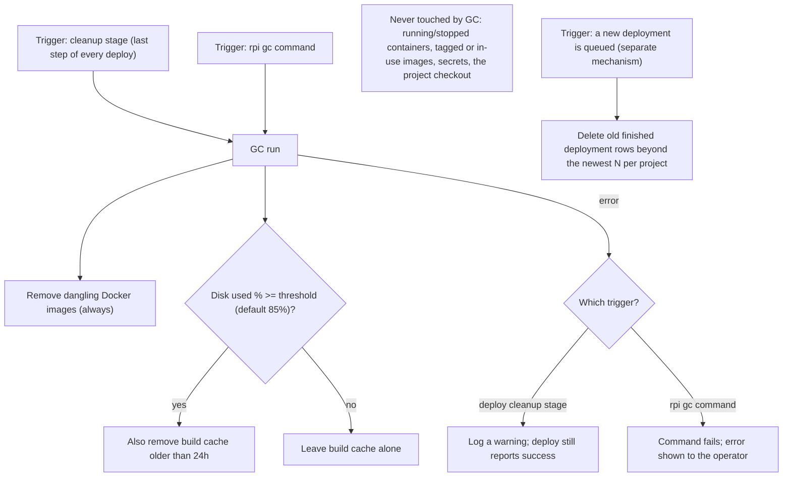

# Cleanup (GC)

rpi keeps disk usage on the Raspberry Pi from growing without bound by
clearing out Docker images and build cache it no longer needs, and by
keeping the deployment-history table capped in size. This cleanup is
sometimes called "GC" (garbage collection) in logs and command names. This
document explains when it runs, exactly what it removes, what it always
leaves alone, and what happens when a cleanup attempt fails.

## Walkthrough

1. **Two ways to trigger a cleanup run.** A cleanup run happens automatically
   as the last step of every deploy, after the optional public-routing step,
   regardless of whether the project declares a public hostname. It also
   runs on demand when an operator runs `rpi gc`, which runs the same
   routine the deploy's cleanup stage invokes in-process.
2. **What always happens.** Every cleanup run removes dangling Docker
   images — images with no tag that also aren't referenced by any
   container. This step always runs, whichever trigger started it.
3. **What happens only under disk pressure.** The run then checks how full
   the disk holding the agent's data directory is. Only when that is at or
   above a configurable threshold (85% by default) does it also clear out
   build-cache layers older than 24 hours. Below the threshold, the build
   cache is left alone on purpose, so that a rebuild right after a deploy
   can still reuse recent layers instead of starting from scratch. Either
   way, the decision and the resulting disk percentage are recorded in the
   log.
4. **What is never touched, and why.** A cleanup run only ever calls two
   Docker maintenance commands (image pruning and build-cache pruning) plus
   a read-only disk-usage check — nothing else is wired into it. That means
   it never removes a container (running or stopped), never removes an
   image that is tagged or still in use, and never touches secrets or the
   project's checked-out source, because none of those are reachable from
   this code path at all.
5. **Failure branch — triggered by a deploy.** The cleanup step that runs at
   the end of a deploy is wrapped in its own 300-second timeout. If pruning
   errors out or times out, the deploy's stage timeline records cleanup as
   skipped, a line explaining why is appended to the deploy log, and the
   deploy itself is still reported as successful — a cleanup problem never
   undoes an otherwise-successful deploy.
6. **Failure branch — triggered by `rpi gc`.** When the same routine is
   invoked directly through `rpi gc`, its error is not swallowed: the
   command itself fails and the operator sees the error, since there is no
   surrounding deploy outcome for the failure to be subordinate to.
7. **A separate, unrelated cleanup: deployment history retention.** Every
   time a new deployment is queued, its history record is inserted and, in
   the same step, any older *finished* (non-active) deployment rows for
   that project beyond the newest N (50 by default, configurable) are
   deleted. Deployments still queued or running are never counted toward
   that limit or deleted, no matter how old they are. This trimming is not
   part of the GC run described above — it is triggered by queuing a
   deployment, not by either of the two GC triggers, and runs even if GC
   itself is never invoked.

## Source anchors

- `crates/application/src/gc.rs` — the GC use case: prunes dangling images
  unconditionally, checks disk usage, and prunes build cache only above the
  configured threshold; propagates any error to its caller.
- `crates/infrastructure/src/disk.rs` — read-only probe that reports the
  used-space percentage of the disk holding the agent's data directory.
- `crates/infrastructure/src/history.rs` — deployment history storage;
  `record_queued` inserts a new row and, in the same call, deletes older
  finished rows for that project beyond the configured retention count,
  independent of GC.
- `crates/infrastructure/src/docker.rs` (prune role only) — builds and runs
  the two Docker CLI commands GC uses: `docker image prune -f` (dangling
  images) and `docker builder prune -f --filter until=24h` (aged build
  cache).
