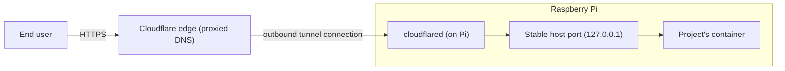

# Cloudflare Tunnel ingress

When a project declares a public hostname, `rpi` publishes it to the internet
through a Cloudflare Tunnel instead of opening any port on the Pi itself.
This document covers the one-time setup that creates or adopts that tunnel,
what happens on every deploy that keeps the hostname routed to the right
place, and the path a real request takes to reach the container. See
`flows/agent-setup.md` for the rest of the one-time bootstrap (installing the
binary, the systemd unit) and `flows/deploy.md` for the full deploy pipeline
this fits into.

```mermaid
sequenceDiagram
    participant Setup as Setup command (one-time)
    participant CF as Cloudflare API
    participant CFD as cloudflared config (on Pi)
    participant Dep as Deploy route stage

    Note over Setup: sudo rpi agent setup --with-cloudflared (token file + domain)
    alt config.yml already present (hand-built tunnel)
        Note over Setup,CFD: adopt in place — tunnel id read straight from config.yml; the file is never rewritten and cloudflared is never restarted for this
    else no config.yml yet
        Setup->>CF: find or create tunnel (by name)
        alt tunnel already exists on Cloudflare
            CF-->>Setup: existing tunnel id (secret not recoverable)
        else no tunnel with that name
            CF-->>Setup: new tunnel id + secret
        end
        Setup->>CFD: write credentials file (fresh tunnels only) + config.yml, enable cloudflared service
    end

    Note over Dep: later, every deploy where rpi.toml declares [ingress].hostname
    Dep->>CFD: read config.yml
    alt hostname already routed to this exact service
        Note over Dep,CFD: no change — DNS and cloudflared left untouched
    else route is new, or points at a different service
        Dep->>CFD: merge one ingress rule (hostname -> host port), keep catch-all last
        Dep->>CF: upsert proxied DNS CNAME for hostname
        Dep->>CFD: restart cloudflared
        alt DNS update or restart fails
            Dep->>CFD: roll back config.yml to its prior contents
        end
    end
```



## Walkthrough

1. **Two different kinds of adoption, both about avoiding downtime.** The
   one-time setup command (`rpi agent setup --with-cloudflared`, detailed in
   `flows/agent-setup.md`) first checks whether a `cloudflared` config file
   already exists on disk. If it does — a tunnel someone built by hand — that
   file is adopted exactly as-is: its tunnel id is read straight out of it,
   the file itself is never rewritten, and `cloudflared` is never restarted
   as part of adopting it. Only when no config file exists yet does setup go
   on to talk to the Cloudflare API at all.
2. **Finding or creating the tunnel resource itself.** In that fresh-install
   case, setup asks the Cloudflare API for a tunnel with the target name.
   If one already exists there (created outside `rpi`, or left over from an
   earlier attempt), its id is reused — but its secret can never be recovered
   from the API, so an adopted tunnel must already have its own credentials
   file sitting on disk, or setup reports an error rather than guessing. If
   no tunnel exists under that name, a brand-new one is created together
   with a freshly generated secret, which setup writes to a credentials file
   it fully owns. Either way, setup then writes (or leaves alone) the
   `config.yml` and enables `cloudflared` as a background service.
3. **From here on, every deploy that declares a hostname repeats a much
   smaller cycle.** `rpi.toml`'s `[ingress].hostname` (see the `rpi-toml`
   skill for the field) is the only thing that triggers this: projects
   without a hostname skip it entirely. The route stage reads the current
   `config.yml`, and only ever touches **one** ingress entry — the one for
   this project's hostname — leaving every other hand-written or
   previously-created rule (and the catch-all, which always stays last)
   untouched.
4. **The route stage is idempotent by design.** If the hostname is already
   pointed at the exact service this deploy would set, nothing is written,
   no DNS call is made, and `cloudflared` is not restarted — the stage still
   reports success either way, so a `route: ok` in the CLI's pipeline view
   doesn't by itself tell you whether the route actually changed this time.
5. **When the route does change,** the new `config.yml` is written first,
   then the Cloudflare API is asked to point a proxied CNAME for the
   hostname at the tunnel (looking up the zone and any existing DNS record
   for that exact name first, updating it in place if one exists or
   creating it otherwise), and finally `cloudflared` is restarted so it
   picks up the new ingress rule. Because the agent runs as a background
   service, restarting a per-user `cloudflared` unit needs a couple of
   environment variables (`XDG_RUNTIME_DIR`, `DBUS_SESSION_BUS_ADDRESS`)
   that the restart command supplies itself whenever they aren't already
   present.
6. **Any failure past the config write rolls the file back.** If the DNS
   update or the restart fails, `config.yml` is restored to exactly what it
   held before this deploy touched it. This is deliberate: leaving the
   edited file in place would make the *next* deploy's "is this already
   routed?" check say yes, and it would never retry the DNS/restart step for
   this hostname again. A DNS record that already got written before the
   failure, though, is not and cannot be undone by this rollback.
7. **Removing a route** (dropping the hostname, or removing the project)
   edits `config.yml` to delete just that one ingress entry and restarts
   `cloudflared` the same way — but it does not delete the DNS record. The
   hostname keeps resolving to the tunnel; once `cloudflared` reloads
   without a matching rule, requests to it simply fall through to the
   catch-all (`http_status:404`) instead of reaching any container.
8. **The stable host port is why `config.yml` rarely needs to change at
   all.** Each project keeps the same host port across every redeploy
   (allocated once, kept stable elsewhere in the pipeline — see
   `flows/deploy.md`), and rpi's own Compose override binds that port to
   `127.0.0.1` by default and pins `restart: unless-stopped` on the public
   service so it survives a host reboot without manual intervention. Because
   the port doesn't change, the `cloudflared` ingress rule doesn't either —
   only a hostname's first deploy, or an explicit change to it, ever
   rewrites `config.yml`. This is also why a project's own Compose file must
   not publish a fixed host port for the same service: doing so fights with
   the port rpi's override is trying to bind, instead of just exposing the
   container port and letting the override supply the host side.
9. **Failure — Cloudflare isn't configured (missing or unreadable token).**
   When Cloudflare ingress isn't set up, or its token file can't be read,
   the agent uses a disabled ingress backend for every deploy until that's
   fixed. A deploy that declares a hostname still completes successfully:
   the route stage is marked **skipped**, not failed, `config.yml` is never
   touched, and a line tells the operator to route the hostname manually
   (with the exact command to enable automatic ingress instead).
10. **Failure — the hostname is already routed elsewhere.** This shows up in
    two different ways depending on what already occupies the name in the
    DNS zone. If a conflicting record already exists there (for example, one
    from an unrelated service), Cloudflare's API rejects the write outright;
    the route stage fails, `config.yml` is rolled back, and the whole deploy
    is marked failed — even though the application container is already up
    and healthy at that point, just not reachable at its hostname. If,
    instead, the hostname is already a *CNAME* — say, adopted by a different
    tunnel, or left behind by a previous rpi project — nothing here checks
    who currently owns it: the record is simply overwritten to point at this
    tunnel. There's no built-in warning for a hostname changing owners this
    way; whichever deploy runs last against that hostname wins the DNS
    record.
11. **Failure — `cloudflared` isn't running (or won't restart).** If the
    configured restart command fails — for instance the systemd `--user`
    unit was never installed, or is broken — the route stage fails and
    `config.yml` is rolled back to its prior contents so the next deploy
    retries the same edit. Any DNS write that already succeeded before the
    restart attempt is left in place, so the public DNS record can briefly
    point at a route `cloudflared` itself doesn't know about yet, until a
    later deploy manages to restart it successfully.

## Source anchors

- `crates/infrastructure/src/cloudflare.rs` — the Cloudflare API client:
  resolves the account from the token, finds-or-creates (adopts) a tunnel by
  name, and upserts the proxied DNS CNAME that points a hostname at the
  tunnel.
- `crates/infrastructure/src/cloudflared.rs` — edits the local `cloudflared`
  `config.yml` (merges exactly one ingress rule, keeps the catch-all last),
  calls the Cloudflare API for DNS, restarts `cloudflared` only when the file
  actually changed, and rolls the file back on any DNS/restart failure; also
  the disabled-ingress fallback used whenever Cloudflare isn't configured.
- `crates/infrastructure/src/hostnet.rs` — best-effort local network address
  detection, used only for the LAN-exposure log line; it does not
  participate in the Cloudflare Tunnel path and does not allocate the stable
  host port (that's `repo.rs`, covered in `flows/deploy.md`).
- `crates/infrastructure/src/overrides.rs` — writes rpi's Compose override
  that maps the allocated host port to the container's port, binds it to
  loopback by default, and pins the `restart: unless-stopped` policy the
  public service needs to survive a reboot.
