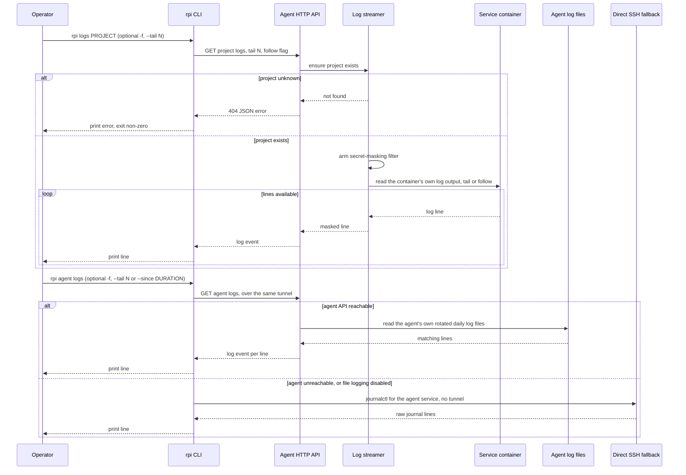
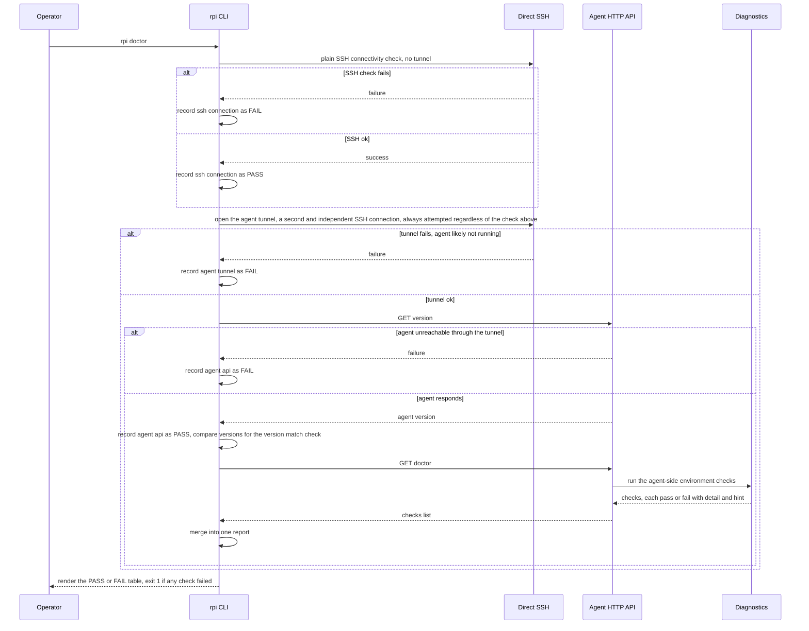

# Observability: logs, stats, and doctor

`rpi logs`, `rpi stats`, and `rpi doctor` are the three ways an operator
looks at a running deployment from outside: reading a container's own
output, watching resource usage over time (optionally as a live-updating
dashboard), and asking the Pi to check itself over. Each one gets its data
from a different place — a container's log output, a background sampler
plus a live per-container reading, or a set of pass/fail checks run on the
Pi itself — but all three follow the same shape: the CLI asks the agent, the
agent answers, and the CLI renders that answer to the terminal.

### Logs



### Stats

```mermaid
sequenceDiagram
    participant Op as Operator
    participant CLI as rpi CLI
    participant Agent as Agent HTTP API
    participant Stat as Stats collector
    participant Src as Host and Docker metrics

    Op->>CLI: rpi stats, optional PROJECT, --json, or -w --interval N
    CLI->>CLI: check the agent advertises stats, the skew gate
    alt agent too old for stats
        CLI-->>Op: error, update the agent on the Pi, exit non-zero
    else agent supports stats
        loop once, or every interval seconds under -w
            CLI->>Agent: GET stats, project optional
            Agent->>Stat: report for the requested project or all
            alt project given but unknown
                Stat-->>Agent: not found
                Agent-->>CLI: 404 error
                CLI-->>Op: no -w: print error and exit; under -w: show reconnecting status and keep polling
            else project resolved or none requested
                Stat->>Src: host sample plus per-service snapshot plus last deploy time
                Src-->>Stat: snapshot
                Stat-->>Agent: stats report
                Agent-->>CLI: JSON body
                CLI-->>Op: no -w: render a table or --json and exit; under -w: redraw the dashboard
            end
        end
        CLI-->>Op: under -w only: q, Esc, or Ctrl-C quits and restores the terminal
    end
```

### Doctor



## Walkthrough

1. **Reading a project's own output.** `rpi logs PROJECT` (optionally
   `-f`/`--follow`, `--tail N`, default 100) sends one request that first
   confirms the project exists, then arms a filter that redacts that
   project's live secret values out of every line before it goes anywhere
   else, then asks the container runtime for that project's own log output —
   the last N lines, and, with `--follow`, every new line as it's produced.
   The lines stream back as the same kind of event stream every other
   streaming command in this codebase uses.
2. **Reading the agent's own output.** `rpi agent logs` (optionally `-f`,
   `--tail N`, or `--since DURATION` instead of a line count) is a different,
   adjacent command: it reads the *agent process's* own rotated daily log
   files on the Pi, not any project's container. As long as the agent's HTTP
   API answers, this behaves like `rpi logs` — a tail or a live follow,
   filtered by a since-timestamp instead of a line count when one is given.
   If the agent API can't be reached at all — the agent process is down, or
   file logging on the Pi happens to be disabled — the CLI automatically
   falls back to running `journalctl` for the agent's systemd service
   directly over plain SSH instead, no tunnel and no HTTP involved, which is
   exactly the situation where reading the agent's own log matters most.
3. **Watching resource usage.** `rpi stats` (optionally a PROJECT, `--json`,
   or `-w`/`--watch` with `--interval N`, default 2s) first checks — using
   the capability list negotiated in the connect handshake, see
   `flows/connect.md` — that the connected agent's version actually serves
   stats at all; an agent too old for it is refused immediately with an
   update hint, before any request is sent. Once that clears, a snapshot
   request asks the agent to combine a continuously-sampled host reading
   (CPU, memory, temperature, plus a short rolling history for graphs) with
   a live, per-service reading pulled straight from the container runtime
   (CPU, memory against its configured limit, and container state), and to
   attach each project's most recent deploy time from the deployment
   history.
4. **One-shot vs. the `-w` live dashboard.** Without `-w`, that's a single
   request-response: the CLI renders it as a static table, or prints the raw
   JSON with `--json`, and exits. With `-w`, the CLI instead takes over the
   whole terminal and repeats that same snapshot request on a background
   timer every `--interval` seconds, feeding each new snapshot to a redraw
   of a full-screen dashboard — metric cards with mini history graphs, plus
   a per-service table — sized to whatever terminal space is available. The
   fetch runs off the redraw/input loop specifically so a slow request
   (Docker stats over SSH can take a noticeable moment) never makes quitting
   feel stuck; `q`, `Esc`, or `Ctrl-C` exits and restores the normal
   terminal.
5. **Checking the Pi over.** `rpi doctor` runs several checks in a fixed
   order, but only some of them gate what comes after. First, a plain SSH
   connectivity check with no tunnel and no HTTP at all. Then, regardless of
   whether that check passed or failed, opening the same tunnel every other
   command uses — a second, independent SSH connection, not a reuse of the
   first one. From the tunnel result onward the checks do gate each other:
   only if the tunnel comes up does the CLI ask the agent's version
   endpoint, and only once that succeeds does it also send one more request
   that asks the agent to run its own list of environment checks on the Pi
   (for example, whether the cgroup memory accounting that `rpi stats`'s
   per-service memory numbers depend on is enabled) and report each one as
   pass or fail with a plain-English detail and, on failure, a suggested
   fix. The CLI adds the version comparison itself as one more row alongside
   that same successful-version-check step, pointing at whichever side is
   behind if the two don't match.

### Failure branches

- **Project unknown (`rpi logs`, `rpi stats`).** Both use cases check the
  project exists before doing anything else. For `rpi logs` and a one-shot
  `rpi stats`, this is an ordinary not-found error: printed, with a
  non-zero exit, before any log line or metrics call is attempted. Inside
  the `-w` dashboard, the same error is treated as a transient hiccup
  instead of a hard stop — the dashboard shows a "reconnecting…" status in
  place of the last good snapshot and keeps polling on schedule, since a
  flaky tunnel and a genuine typo in the project name look identical at
  that layer.
- **Agent lacking a newer stats feature (the skew gate).** `rpi stats` is
  refused up front, before any HTTP call, if the connected agent's version
  doesn't advertise stats support — the CLI prints which side needs
  updating and exits, rather than letting the request fail deep inside a
  live dashboard.
- **Doctor's short-circuit.** The plain SSH connectivity check does *not*
  gate the tunnel: the CLI opens the agent tunnel as a second, independent
  SSH connection regardless of whether that first check passed or failed, so
  both of those rows are always attempted and recorded. The short-circuit
  proper starts at the tunnel — if it fails to come up, or the agent is
  unreachable through it once it's up, every check from that point on is
  skipped and reported as FAIL. In practice the SSH check and the tunnel
  tend to fail or pass together, since both ride an SSH connection to the
  same host, but they are two separate connections and a passing SSH check
  is no guarantee the tunnel will come up. The command's exit code is 1 if
  any row failed at all (whether from the tunnel-stage short-circuit or a
  later agent-side check), 0 only when every row passed.
- **Agent's own logging unavailable (`rpi agent logs`).** Whether the cause
  is the agent process being down or just its on-disk file logging being
  disabled, the CLI can't tell the difference and doesn't need to — either
  way it falls back to reading the systemd journal for the agent's service
  directly over SSH.

## Source anchors

- `crates/application/src/logs.rs` — the `StreamLogs` use case behind
  `rpi logs`: confirms the project exists, arms the secret-masking filter,
  then asks the container runtime for the tail (and optional follow) of
  that project's log output.
- `crates/application/src/tail.rs` — a generic last-N-lines buffer. It is
  not on the `rpi logs`/`stats`/`doctor` request paths directly; it is what
  lets a finished `rpi deploy` run's log tail be replayed later (see
  `flows/deploy.md`), and is grouped here as shared log-buffering
  infrastructure.
- `crates/application/src/stats.rs` — the `GetStats` use case behind
  `rpi stats`: resolves which project(s) to report on, asks the metrics
  provider for a snapshot, and attaches each project's last-deploy time from
  the deployment history.
- `crates/application/src/diagnostics.rs` — `RunDiagnostics` (the
  agent-side check list `rpi doctor` asks for) and `AgentStatus`
  (`rpi status`'s uptime/disk/project counts), both backed by the system
  probe.
- `crates/infrastructure/src/metrics.rs` — the host metrics sampler: a
  background loop that takes a CPU/memory/temperature reading on a fixed
  cadence into an age-evicted ring buffer, which is what supplies
  `rpi stats`'s current values and its short history graphs.
- `crates/infrastructure/src/sys.rs` — small system-facing adapters (a
  system clock, a UUID generator) used across the agent; not specific to
  logs, stats, or doctor, but this crate's home for that kind of small
  system utility.
- `crates/infrastructure/src/events.rs` — a broadcast hub with a capped
  backlog that replays a deployment's log stream to a client that
  (re)subscribes mid-run. It backs `rpi deploy`'s log follow (see
  `flows/deploy.md`), not `rpi logs`/`stats`/`doctor`; grouped here
  alongside `tail.rs` as the other half of the same log-replay
  infrastructure.
- `crates/bin/src/agent/logfile.rs` — reads, tails, and follows the agent's
  own daily log files on disk; the data source behind `rpi agent logs`,
  separate from a project's container logs.
- `crates/bin/src/cli/stats_view.rs` — pure view-model for the `-w`
  dashboard (rendering role only): turns a stats snapshot into metric cards,
  a scaled memory bar per service, and a layout choice based on terminal
  size, with no terminal I/O of its own.
