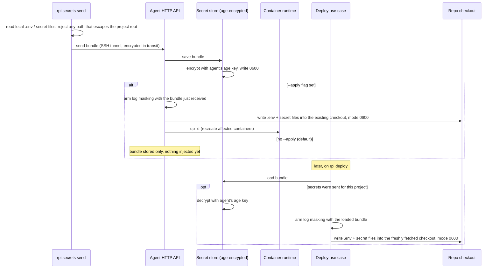

# Secrets lifecycle

This document explains what happens to a project's secrets — its `.env`
variables and any other secret files — from the moment they leave the
developer's machine to the moment they land inside a running container on
the Pi. It covers how they are protected while traveling to the agent, how
they are protected while sitting on disk, the two different moments they can
be written into a checkout, and how their values are kept out of logs.

## Walkthrough

1. **What can be a secret.** `rpi secrets send` reads the project's `.env`
   file (the default, or whichever file `[secrets].env` names) plus every
   file listed under `[secrets].files` — arbitrary files such as TLS
   certificates, not just key/value variables. Every one of those paths is
   validated before anything leaves the machine: it must be a plain relative
   path with no `..`, no leading slash, no backslashes or drive letters, and
   it must not resolve (following any symlink) outside the project root. A
   path that fails this check is rejected on the client; nothing is sent.

2. **Protected in transit.** The bundle travels to the agent over the same
   SSH tunnel used for every CLI-to-agent request, so it is never sent in
   the clear over the network.

3. **Protected at rest.** As soon as the agent receives the bundle, the
   secret store encrypts it whole — variable values and file contents alike
   — with age, using a keypair the agent generated for itself the first time
   it ran and keeps on disk at file mode 0600. The encrypted bundle is
   written one file per project: the secret store's own copy of a bundle is
   never written to disk unencrypted. (A bundle's values do reach disk as
   plaintext elsewhere — deliberately, when injected into a checkout; see
   item 4.)

4. **Two moments secrets get injected.** Plaintext secret values are
   written into a checkout only during one of these two operations, never
   in between:
   - **Immediately, with `--apply`.** Right after saving, if the caller
     passed `--apply`, the agent writes `.env` and the secret files straight
     into the project's existing checkout (mode 0600) and recreates the
     affected containers — using the bundle it already has in memory from
     the request itself, with no decrypt step involved.
   - **Later, on `rpi deploy`.** Every deploy loads whatever is currently
     stored for that project — decrypting it in the process — and writes it
     into the freshly fetched checkout (mode 0600) before the stack starts.
     This is the only place a previously-stored bundle's values are
     decrypted and written back out onto disk as plaintext.

   `rpi secrets ls` also decrypts a previously-stored bundle, but only in
   memory and only to read the secret and file names it contains — the
   values themselves are discarded and never written to disk or shown.
   Re-sending a bundle later fully replaces the previous one: any variable
   or file left out of the new bundle is removed from a checkout the next
   time secrets are injected.

5. **Masking secret values in logs.** From the moment either injection above
   arms it, every line the agent would otherwise log during that operation
   has each secret variable's value (6 characters or longer) replaced with
   `***KEY***`, longest values checked first so one secret's value can never
   hide inside another's. Shorter values (ports, booleans) are left alone on
   purpose, to avoid masking ordinary output that happens to match a short
   value. Secret file contents are not scanned for masking.

6. **Failure: sending to a project that doesn't exist.**
   `rpi secrets send --apply` for a project the agent has never deployed
   fails — the response reports the project isn't deployed yet and to run
   `rpi deploy` first. The bundle is still saved, encrypted, before this
   check runs, so a subsequent `rpi deploy` picks it up normally. Sending
   without `--apply` does not check whether the project is deployed at all:
   only the project name itself is validated, so secrets for a name that
   hasn't been deployed yet are simply stored, waiting for the first
   deploy.

7. **Failure (silent): deploy without secrets sent.** If nothing was ever
   sent for a project, the store has nothing to return for it. `rpi deploy`
   proceeds without writing a `.env` file or any secret files — this is not
   reported as an error; the service just starts without them, and it is up
   to the service to cope with the missing configuration.

8. **Failure: path traversal rejected.** Every secret file's relative path
   is validated twice against the same rule — once by the CLI before
   sending, and again by the agent at the moment it writes to disk — so a
   path that escapes the project root is caught however it got there.
   Writing also refuses to create, or write through, a symlink at any
   intermediate directory level, so a symlink committed into the repository
   itself cannot redirect a write outside the checkout. Either check failing
   aborts that write instead of touching the filesystem outside the
   checkout.

## Source anchors

- `crates/application/src/secrets.rs` — send/list secrets use cases: validates the bundle isn't empty, saves it, and (with `--apply`) re-injects it and restarts the affected containers immediately.
- `crates/bin/src/cli/rpitoml.rs` (`SecretsSection` only) — the `[secrets]` table in `rpi.toml`: names the local env file `rpi secrets send` reads (`[secrets].env`, default `.env`) and the extra files it reads verbatim (`[secrets].files`).
- `crates/application/src/mask.rs` — `MaskingSink`: replaces armed secret values (6+ characters) with `***KEY***` in every line logged afterward.
- `crates/infrastructure/src/secrets.rs` — `EncryptedFileStore`: age-encrypts and decrypts the bundle at rest, one file per project, using an agent identity key kept at file mode 0600.
- `crates/infrastructure/src/secretsfile.rs` — `FsSecretsWriter`: writes `.env` and secret files into a checkout (files 0600, directories 0700), replaces the previous bundle's files via a small manifest, and guards every write and cleanup against symlink escapes.
- `crates/infrastructure/src/secretpath.rs` — shared relative-path validation and symlink-safe path resolution, used by both the CLI (before sending) and the agent (before writing).
- `crates/infrastructure/src/dotenv.rs` — `.env` parsing and serialization shared by the CLI (reading the local file to send) and the agent (writing the injected file).
- `crates/application/src/deploy.rs` — the deploy pipeline's secret-injection point: loads the stored bundle, arms masking, and writes it into the freshly fetched checkout before the stack starts.
