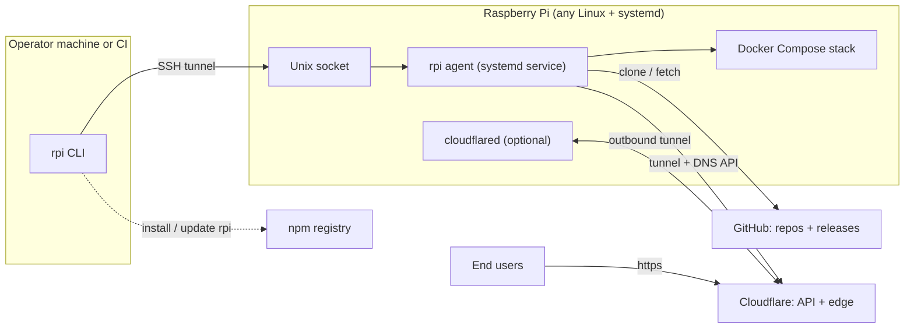

# System Overview

`rpi` deploys Docker Compose projects from a Git repository onto a Raspberry
Pi — or any Linux machine running `systemd`. The same program plays two
different roles: a command-line tool that runs on your own computer or in
CI, and a background service that runs on the Pi. The two halves only ever
meet over an SSH tunnel connected to a Unix socket, so the Pi never needs to
open any network port beyond the SSH port it already has for remote login.

## Walkthrough

1. **One binary, two roles.** `rpi` is a single executable with one command
   enum covering every subcommand. When you run `rpi agent run`, the program
   branches straight into the agent's own startup path before it even sets
   up the CLI's terminal logging — so the exact same binary behaves as a
   long-running daemon on the Pi, or as a one-shot client on your machine,
   purely based on which subcommand you typed.
2. **Getting the binary.** Both roles are installed from the same npm
   package, `rpi-deploy` — on your machine (`npm install -g rpi-deploy`) and
   again, with `sudo`, on the Pi. That's what the dotted `npm` edge
   represents: it's how either side obtains or updates the `rpi` executable,
   not something the running agent talks to at deploy time.
3. **The CLI opens a fresh SSH tunnel per command.** Every non-agent `rpi`
   subcommand spawns its own `ssh -L <local-port>:/run/rpi/agent.sock -N`
   process (batch mode, no prompts), waits up to 10 seconds for that local
   port to accept a connection, and tears the SSH process down again when
   the command finishes. Because the far end of the tunnel is a Unix socket
   path rather than a TCP port, nothing new is reachable from outside the
   Pi except what SSH already exposes — there is no separate listening port
   for the agent itself. (A `PI_AGENT_URL` environment variable can bypass
   the tunnel for local development against a plain TCP agent; that path is
   never used against a real Pi.)
   - *Failure branch:* if the tunnel doesn't come up in time — wrong host,
     no SSH access, or the agent isn't running so nothing is listening on
     the socket — the CLI aborts with an error telling you to check SSH
     access, and no HTTP request is ever attempted. Nothing beyond the
     pre-existing SSH port was ever exposed for that attempt.
4. **Requests land on the agent's HTTP API.** On the Pi, the agent process
   loads its config, starts a background host-metrics sampler, and serves an
   HTTP router — either on the Unix socket (file mode `0660`, so only
   members of the `rpi-agent` group, i.e. the SSH login user added during
   `rpi agent setup`, can connect), or on a plain TCP address when `agent.toml`
   sets one (Windows / local-dev only). That router is what every non-agent
   `rpi` subcommand ultimately calls: creating, inspecting, or cancelling
   deployments; listing, removing, or controlling projects; streaming logs;
   sending env vars and secrets; and agent-level status, stats, doctor, logs,
   and garbage collection.
5. **Startup self-healing.** Before serving any request, the agent sweeps its
   own deployment history: anything still marked "in progress" from a
   previous run — because the process crashed or the Pi rebooted mid-deploy
   — is marked interrupted. A stale "running" status never survives an
   agent restart.
6. **A deploy drives Docker Compose and Git.** Handling a deploy request
   builds and starts the project's Docker Compose stack and clones or
   fetches the project's repository from GitHub as part of that pipeline
   (the pipeline itself is covered in `flows/deploy.md`, not here).
7. **Publishing a service (optional).** When a project declares a public
   hostname, the agent edits the local `cloudflared` config file to add or
   update a routing rule, asks the Cloudflare API to point that hostname's
   DNS record at the tunnel, and restarts the local `cloudflared` unit —
   but only when the config actually changed, so unrelated deploys leave
   already-routed projects untouched. Creating or adopting the Cloudflare
   Tunnel resource itself, and installing `cloudflared`, happens once via
   `rpi agent setup --with-cloudflared`, not on every deploy.
   - *Failure branch:* if updating DNS or restarting `cloudflared` fails,
     the config edit is rolled back to what was on disk before the attempt,
     so a failed attempt can't leave the agent believing a route is live
     that `cloudflared` never picked up.
8. **The tunnel carries public traffic independently.** Whenever
   `cloudflared` is installed, it keeps one outbound-only connection open to
   Cloudflare's edge. Cloudflare terminates public HTTPS from end users and
   forwards matching requests down that existing outbound connection to the
   service's local port — so inbound traffic never needs an open port on
   the Pi either.
9. **Failure branch — agent unreachable.** Whether the SSH tunnel never came
   up or the agent process itself is down, the CLI reports a connection
   error and exits. There is no partial success: nothing is left listening
   or exposed on the network as a result of a failed attempt.

## Source anchors

- `crates/bin/src/main.rs` — CLI entry point; one `Cli`/`Cmd` definition for
  every subcommand, branching straight into the agent daemon for
  `agent run` before any CLI-only setup runs.
- `crates/bin/src/cli/tunnel.rs` — opens the per-command SSH tunnel
  (`ssh -L <port>:/run/rpi/agent.sock -N`) that is the only way the CLI
  reaches the agent.
- `crates/bin/src/agent/run.rs` — agent process bootstrap: loads config,
  starts the metrics sampler, sweeps interrupted deployments, and serves the
  HTTP router on the Unix socket (or TCP in dev mode).
- `crates/bin/src/agent/http.rs` — the HTTP router (`router()`) mounted on
  the socket; defines every endpoint the CLI's commands call.
- `crates/infrastructure/src/cloudflared.rs` — manages the local
  `cloudflared` process: edits its ingress config, updates DNS through the
  Cloudflare API, and restarts it only when the config changed.
