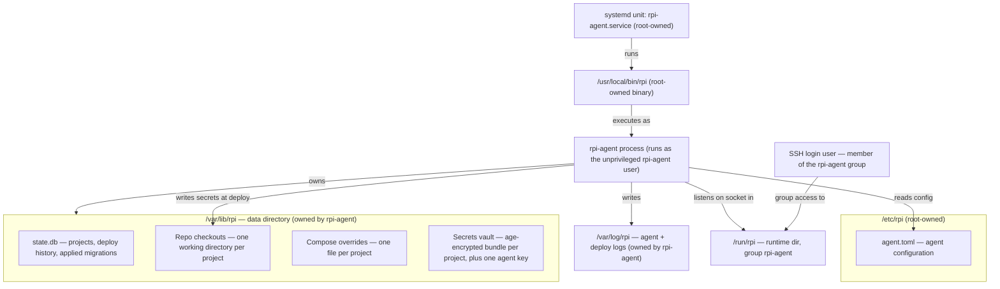

# Storage: What the Agent Keeps on the Pi

rpi's agent is a single background program that runs on the Raspberry Pi and
keeps almost everything it needs in one place on disk: a small database of
configured projects and their deploy history, a working copy of each
project's Git repository, and an encrypted vault of the secrets (passwords,
API keys, certificates) those projects need at runtime. A handful of other
files sit outside that one place — the agent's own configuration file, the
systemd service definition that starts it, and its log files — each owned by
a different account depending on how sensitive it is. This document maps
every one of those locations: what lives where, who is allowed to read or
write it, and what happens to each piece when the agent is upgraded,
reinstalled, or torn down.

## Walkthrough

1. **One data directory holds the durable state.** On startup the agent reads
   its configuration file (`/etc/rpi/agent.toml` by default) and creates its
   data directory if it doesn't already exist — `/var/lib/rpi` unless
   overridden by the `data_dir` setting. Everything the agent needs to
   survive a restart lives under this one directory: the database, every
   project's repository checkout, per-project override files, and the
   encrypted secrets vault.
   - *Failure branch:* a missing configuration file is not an error — the
     agent falls back to built-in defaults (data directory `/var/lib/rpi`,
     Unix socket `/run/rpi/agent.sock`, port range 8000-8999, and so on) and
     starts anyway.
   - *Failure branch:* a configuration file declaring a schema number newer
     than this build supports is a hard error — the agent refuses to start
     rather than guess at an unfamiliar format.

2. **The database is the source of truth for projects and deploy history.**
   A single SQLite file inside the data directory holds one row per
   configured project (its Git repository and branch, which compose file and
   service to run, which container port maps to which host port, its public
   hostname/exposure setting, and any custom commands with their timeout),
   and one row per deploy attempt (which commit was deployed, its status —
   queued, running, succeeded, failed, or interrupted — its start/finish
   times, and a short trailing excerpt of its log output). The database
   enforces that project names and host ports are each unique, so two
   projects can never collide on the same port. Old, finished deploy rows
   for a project are pruned automatically after each new deploy starts,
   keeping only a configurable number of recent ones per project — a
   deployment that's still queued or running is never pruned, no matter how
   old it gets. The database opens in a mode that tolerates concurrent
   readers safely, and every write goes through a single serialized
   connection.
   - *Failure branch:* if the database file can't be opened or its table
     structure can't be brought up to date, the agent fails to start at all
     rather than run against a stale or partial schema.

3. **Two independent kinds of migration share the database.** Every time the
   agent opens the database, it brings the table structure itself up to date
   automatically — adding columns or tables introduced by newer agent
   versions. This is invisible and always runs. Separately, the database
   also has a small bookkeeping table recording which one-time, host-level
   migrations (for example, a past rename of the whole installation) have
   already been applied, so a migration that needs special handling only
   ever runs once per Pi. Today's only such migration detects the old
   installation by inspecting the filesystem directly rather than consulting
   that bookkeeping table — the table exists for a future migration that
   can't self-detect that way.

4. **Repo checkouts are per-project working directories inside the data
   directory.** Each configured project has its own repository checkout
   inside the data directory. This is also where a deploy actually runs its
   compose commands, and where secrets get written at deploy time (step 7).

5. **Compose overrides are small per-project files the agent writes itself.**
   Alongside each project's checkout, a separate file inside the data
   directory records state the agent needs to remember about that project
   (such as a manual stop) — kept apart from anything coming from the
   project's own Git history.

6. **Secrets sit at rest encrypted, inside the data directory, separate from
   where they get used.** The agent keeps its own encrypted secrets vault
   inside the data directory: one encrypted bundle per project, plus a
   single key (generated the first time the agent ever starts) that every
   bundle is encrypted against. Nothing about a project's secrets is ever
   stored in plain text there.

7. **Secrets are only ever written to plain disk at deploy time, narrowly.**
   When a project deploys, its current secrets are decrypted and written
   into that project's own checkout — its variables into a single file,
   permissioned so only the agent's own account can read it, and any secret
   files at the paths the project declared, in freshly-created directories
   permissioned the same way. Every path is validated before use, so nothing
   in a project's Git history can point a write (or a later read) outside
   its own checkout — including via a directory a later commit replaces with
   a symlink. Writing secrets fully replaces what was there before: a secret
   file dropped from a project's declared list is deleted on the next
   deploy rather than left behind forever. The full mechanics of collecting,
   validating, and delivering secrets are covered in `flows/secrets.md`;
   this document only answers where they live before and after that
   handoff.

8. **Logs live in their own directory, separate from the data directory.**
   Rolling log files for the agent and for individual deploys are written to
   their own location (`/var/log/rpi` by default, configurable, with a
   retention window). This is distinct from the short log excerpt kept per
   deployment row in the database — that excerpt is just enough to show
   recent output at a glance. The full log detail, its rotation, and
   disk-driven cleanup are covered in `flows/observability.md` and
   `flows/gc.md`.

9. **Ownership splits along a privilege boundary.** The configuration file,
   the systemd service definition, and the agent's own program file are all
   owned by `root` — an operator with root access controls how the agent is
   configured and started, but the agent itself never runs with that
   privilege. Everything the agent actually reads and writes at runtime — the
   data directory and the log directory — is owned by a dedicated,
   unprivileged system account created specifically for this purpose, which
   cannot log in and belongs to the group that runs containers. The SSH user
   used to reach the Pi is added only to that account's group, which is what
   lets ordinary deploy/status commands reach the agent's API over its local
   socket without needing root — it grants no ownership of any agent-owned
   file.

10. **An optional integration shares the same data directory.** When
    automatic public-hostname routing is turned on, its tunnel configuration
    and credentials, along with an API token used to manage DNS, also live
    under the data directory — the token under stricter, separately-grouped
    permissions than the rest. Where that integration is set up and how it's
    used at deploy time are covered in `flows/agent-setup.md` and
    `flows/ingress.md`; it shares this data directory rather than having its
    own.
    - *Failure branch:* if that API token can't be read from disk, automatic
      routing is disabled for that start — deploys still complete, they just
      don't get an automatic public route until the token is fixed.

11. **What survives an agent update.** Replacing the agent's program file and
    restarting the service touches none of the data directory or log
    directory — the database, every checkout, and the secrets vault
    (including its key) are untouched by an upgrade.

12. **What survives a reinstall.** Re-running setup is designed to adopt and
    preserve: it never touches the database or the secrets key, it only
    writes the configuration file or the service definition when one isn't
    already present (an existing one is left alone, or backed up before
    being replaced if it's out of date), and it only repairs file ownership
    on directories that already exist rather than recreating them — which
    matters after an uninstall/reinstall cycle leaves the same directory
    owned by a since-reused numeric account ID. The one way to actually lose
    everything is to delete the data directory itself.

13. **A legacy rename is handled as a one-time special case.** If setup
    detects a Pi still running under the project's old name, it renames the
    system account and its group (keeping the same underlying numeric ID, so
    file ownership needs no repair), moves the data, config, and log
    directories to their new names, and rewrites the old paths baked into
    the moved configuration and service files.
    - *Failure branch:* a failure partway through this step (for example,
      renaming the account) is recorded as an error and stops the migration
      there, rather than leaving the agent to restart against a directory
      that no longer exists at its old path.

14. **Local development uses a different, non-privileged layout entirely.**
    Outside of a real Pi install, the agent can run with its data directory
    set to a plain relative folder and a TCP address instead of a Unix
    socket — no system account, no systemd unit, and none of `/etc`,
    `/var/lib`, or `/var/log` involved at all. This mode exists purely for
    developing and testing the agent on a machine — including a non-Linux
    one — that never runs the real installer.

## Source anchors

- `crates/infrastructure/src/sqlite.rs` — opens the SQLite database in a
  mode that tolerates concurrent readers, inside the data directory, and
  defines the projects/deployments tables plus the schema-migration
  mechanism that runs automatically on every open.
- `crates/infrastructure/src/history.rs` — reads and writes the deployments
  table: recording a deploy's queued/running/finished status, and enforcing
  the keep-per-project retention that prunes old finished rows.
- `crates/infrastructure/src/migrations.rs` — the bookkeeping table and
  ledger for one-time, host-level migrations, distinct from the automatic
  schema migrations in `sqlite.rs`.
- `crates/infrastructure/src/secretsfile.rs` — writes a project's decrypted
  secrets into its checkout at deploy time (its variables plus any declared
  files), validating paths and refusing to follow a symlink, and replacing
  the previous write in full.
- `crates/infrastructure/src/secretpath.rs` — the relative-path validation
  and symlink-escape check shared by the deploy-time writer above and the
  CLI/agent code that reads secret files back.
- `crates/bin/src/agent/config.rs` — parses `agent.toml`, its built-in
  defaults (data directory, socket, ports, log directory, timeouts, etc.),
  and the schema-version check that refuses a config from a newer agent.
- `crates/bin/src/agent/state.rs` — wires the data directory into every
  on-disk store at startup (database, secrets vault, repo checkouts,
  per-project overrides) and the optional Cloudflare integration's token
  file.
- `crates/bin/src/agent/setup.rs` — creates the system account and its
  group memberships, the data/log/config directories and their ownership,
  the configuration file and systemd unit templates, and the one-time
  legacy rename.
- `dev/agent.toml` — the local-development configuration: a relative data
  directory and a TCP address instead of the Pi's Unix socket layout.
