# Architecture Documentation Implementation Plan

> **For agentic workers:** REQUIRED SUB-SKILL: Use superpowers:subagent-driven-development (recommended) or superpowers:executing-plans to implement this plan task-by-task. Steps use checkbox (`- [ ]`) syntax for tracking.

**Goal:** Create `docs/architecture/` — 13 English-language Mermaid documents explaining rpi at component/process level for a reader who does not read Rust — plus two repo skills (`architecture-diagrams`, `architecture-audit`) and a CLAUDE.md rule that keep the docs current.

**Architecture:** Hand-written markdown docs, each ending in a `Source anchors` section listing the code files it describes. The `architecture-diagrams` skill holds conventions and a code-area→doc map; the `architecture-audit` skill diffs every doc against its anchors on demand. Spec: `docs/superpowers/specs/2026-07-13-architecture-docs-design.md`.

**Tech Stack:** GitHub-flavored markdown, Mermaid (rendered natively by GitHub/IDE preview — no tooling), repo skills in `.claude/skills/*/SKILL.md`.

## Global Constraints

- All documents in English. Code identifiers, command names, and file paths appear as-is.
- Detail stops at crates, modules-as-roles, and process flows. **No class/trait diagrams.**
- Mermaid nodes/participants are named by role ("Deploy use case", "SSH tunnel"), **never** by code identifiers. Soft cap ~20 nodes per diagram; past that, split the diagram.
- Diagram type by purpose: `flowchart` for context/components/data location; `sequenceDiagram` for "who calls whom" flows; `stateDiagram-v2` for the deploy queue lifecycle.
- Every doc follows the four-section template **in order**: (1) title + one plain-English paragraph, no Rust terminology; (2) Mermaid diagram(s); (3) numbered prose walkthrough including failure branches; (4) closing `## Source anchors` bullet list (`path — role note`). Source anchors are the **only** place code paths appear.
- No diagram autogeneration. No CI validation of Mermaid. No e2e tests (documentation-only change).
- Commit messages end with `Co-Authored-By: Claude Fable 5 <noreply@anthropic.com>`.
- Prefix shell commands with `rtk` (`rtk git add …`), per repo CLAUDE.md.

### Authoring workflow (applies to every doc task)

1. **Read every source file listed in the task first.** You are extracting behavior ("what happens, in what order, what fails how"), not reviewing code. Skim structure, read the orchestrating functions closely.
2. The diagram skeleton given in the task is a **starting shape, not the truth**. Where the code disagrees with the skeleton (stage names, order, participants, error paths), follow the code and fix the skeleton. Never invent behavior not present in the code.
3. Write the doc per the template above.
4. Run the Mermaid syntax checklist (below) over every diagram.
5. Cross-check: every source file you read that shaped the doc appears in `Source anchors`; every anchor listed was actually read.

### Mermaid syntax checklist (run per diagram)

- Block fenced exactly as ` ```mermaid ` … ` ``` `.
- `flowchart`: every `subgraph` has a matching `end`; labels containing `( ) [ ] { } |` or commas are wrapped as `id["label text"]`; no node id named bare `end`.
- `sequenceDiagram`: every `alt`/`opt`/`loop`/`par` has a matching `end`; arrows are `->>` (call) / `-->>` (return); notes use `Note over A,B: text`.
- `stateDiagram-v2`: start/end is `[*]`; transitions are `A --> B: label`.
- No raw HTML in labels; no tab characters inside the block; ≤ ~20 nodes/participants.

---

### Task 1: `architecture-diagrams` skill

**Files:**
- Create: `.claude/skills/architecture-diagrams/SKILL.md`

**Interfaces:**
- Consumes: nothing (first task).
- Produces: conventions + code-area→doc map that every later doc task follows, and that Task 14's CLAUDE.md rule and Task 15's audit reference by the skill name `architecture-diagrams`.

- [ ] **Step 1: Write the skill file**

Write `.claude/skills/architecture-diagrams/SKILL.md` with exactly this content:

````markdown
---
name: architecture-diagrams
description: Use when changing code behavior or structure in this repo, or when creating or editing files under docs/architecture/ — conventions, document template, and update procedure for the Mermaid architecture docs.
---

# Architecture Diagrams

`docs/architecture/` explains the system at component/process level for a
reader who does not read Rust. English only; Mermaid inside GFM (GitHub
renders it natively). This skill defines the conventions and the update
procedure. Full design: `docs/superpowers/specs/2026-07-13-architecture-docs-design.md`.

## When code changes

1. Match the files you touched against the map below; update every affected
   doc **before finishing the task** (this is a CLAUDE.md requirement).
2. Updating a doc means all three: diagram, numbered prose walkthrough, and
   `Source anchors` stay consistent with each other and the code.
3. No matching row but you added a crate/module/process or a new external
   actor: update `crates.md` (and `overview.md` for external actors), and
   create a new `flows/<name>.md` from the template if a new user-visible
   process appeared.

## Code-area → doc map

| Code area touched | Update |
|---|---|
| `crates/application/src/deploy.rs`, `scheduler.rs`; `crates/infrastructure/src/{git,repo,docker,health,probe,hostnet,overrides}.rs` | `flows/deploy.md` |
| `crates/bin/src/cli/{connect,ssh,tunnel,api,config}.rs`, `crates/bin/src/compat.rs` | `flows/connect.md` |
| `crates/application/src/{secrets,mask}.rs`; `crates/infrastructure/src/{secrets,secretsfile,secretpath,dotenv}.rs` | `flows/secrets.md` |
| `crates/infrastructure/src/{cloudflare,cloudflared}.rs` | `flows/ingress.md` |
| `crates/bin/src/agent/{setup,self_install}.rs`, `scripts/install.sh`, `scripts/postinstall.js`, `bin/rpi.js` | `flows/agent-setup.md` |
| `crates/bin/src/agent/{update,release}.rs`, `crates/bin/src/cli/upgrade.rs` | `flows/agent-update.md` |
| `crates/application/src/command.rs`, `crates/bin/src/cli/sse.rs` | `flows/commands.md` |
| `crates/application/src/{logs,tail,stats,diagnostics}.rs`; `crates/infrastructure/src/{metrics,sys,events}.rs`; `crates/bin/src/cli/stats_*.rs`; `crates/bin/src/agent/logfile.rs` | `flows/observability.md` |
| `crates/application/src/gc.rs`; `crates/infrastructure/src/{disk,history}.rs` | `flows/gc.md` |
| `Cargo.toml` workspace members, any `crates/*/src/lib.rs`, `crates/domain/src/contracts.rs` | `crates.md` |
| `crates/infrastructure/src/{sqlite,history,migrations,secretsfile,secretpath}.rs`; `crates/bin/src/agent/{config,state}.rs` | `storage.md` |
| `crates/bin/src/agent/http.rs` routes, `crates/bin/src/proto.rs`, `crates/bin/src/cli/commands.rs` | the flow doc of the affected command, plus `crates.md` if the request path itself changed |
| New external actor (registry, API, cloud service) | `overview.md` |

## Document template

Every doc has exactly these sections, in order:

1. **Title + one paragraph** stating what the document explains, in plain
   English, no Rust terminology.
2. **Mermaid diagram(s).**
3. **`## Walkthrough`** — numbered steps of what happens, including failure
   branches (what the user sees when a stage fails, a version is too old,
   a deploy is superseded, …).
4. **`## Source anchors`** — bullet list, one per code file the doc
   describes: `` `path` — role note``. This is the only place code paths
   appear in the doc.

## Mermaid style rules

- Nodes/participants named by role, never by code identifiers:
  "Deploy use case", not `DeployUseCase`; "Agent HTTP API", not `http.rs`.
- Diagram type by purpose: `flowchart` = context/components/data location;
  `sequenceDiagram` = who-calls-whom; `stateDiagram-v2` = lifecycles.
- Soft cap ~20 nodes per diagram — split rather than grow.
- No class/trait diagrams; detail stops at components and processes.

## Definition of done

- [ ] Diagram updated and consistent with the prose walkthrough.
- [ ] Failure branches in the walkthrough match current behavior.
- [ ] `Source anchors` list updated (added/removed files reflected).
- [ ] Every diagram passes: fences correct, `subgraph`/`alt`/`opt`/`loop`
      blocks closed with `end`, special characters in labels quoted
      (`id["label (text)"]`), ≤ ~20 nodes.
````

- [ ] **Step 2: Verify skill file conventions**

Compare frontmatter shape against `.claude/skills/add-cli-command/SKILL.md`: exactly two keys (`name`, `description`), description starts with "Use when". Verify the table renders (pipes balanced on every row).

- [ ] **Step 3: Commit**

```bash
rtk git add .claude/skills/architecture-diagrams/SKILL.md
rtk git commit -m "chore(skills): add architecture-diagrams conventions skill

Co-Authored-By: Claude Fable 5 <noreply@anthropic.com>"
```

---

### Task 2: `docs/architecture/overview.md`

**Files:**
- Create: `docs/architecture/overview.md`
- Read first: `README.md` (intro + Highlights), `crates/bin/src/main.rs` (command list), `crates/bin/src/cli/tunnel.rs`, `crates/bin/src/agent/run.rs`, `crates/bin/src/agent/http.rs` (router only), `crates/infrastructure/src/cloudflared.rs` (role only)

**Interfaces:**
- Consumes: template + style rules from Task 1's skill.
- Produces: `docs/architecture/overview.md`, linked by Task 12's README as the first document in reading order.

- [ ] **Step 1: Read the sources** (per Authoring workflow — extract: which processes run where, what talks to what, which external services exist)

- [ ] **Step 2: Write the doc**

One paragraph: rpi deploys Docker Compose projects from Git to a Pi; the CLI runs on the operator's machine, the agent on the Pi; they meet over an SSH tunnel to a Unix socket, so the Pi exposes only SSH. Then the context diagram — starting shape (correct against code):

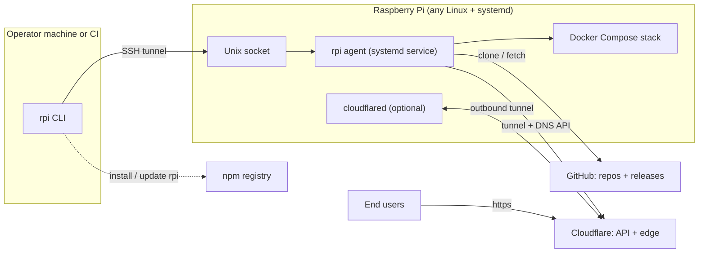

Walkthrough must cover: where each binary runs (same `rpi` executable, two roles), why no ports are open on the Pi, what each external actor is used for, and the failure branch "agent unreachable → CLI error, nothing exposed". `Source anchors`: the five source files read in Step 1 (not README.md), each with a role note.

- [ ] **Step 3: Verify** — Mermaid syntax checklist + anchors cross-check (per Authoring workflow).

- [ ] **Step 4: Commit**

```bash
rtk git add docs/architecture/overview.md
rtk git commit -m "docs(architecture): add system context overview

Co-Authored-By: Claude Fable 5 <noreply@anthropic.com>"
```

---

### Task 3: `docs/architecture/crates.md`

**Files:**
- Create: `docs/architecture/crates.md`
- Read first: `Cargo.toml` (workspace members), `crates/domain/src/lib.rs`, `crates/application/src/lib.rs`, `crates/infrastructure/src/lib.rs`, `crates/domain/src/contracts.rs` (trait names + one-line purposes only), `.claude/skills/add-cli-command/SKILL.md` (the request-path chain it documents)

**Interfaces:**
- Consumes: template + style rules from Task 1's skill.
- Produces: `docs/architecture/crates.md` — the layering reference other flow docs assume.

- [ ] **Step 1: Read the sources** (extract: which crate depends on which, what "contracts" means, the full CLI→agent request path)

- [ ] **Step 2: Write the doc**

Two diagrams. Layer diagram (starting shape):

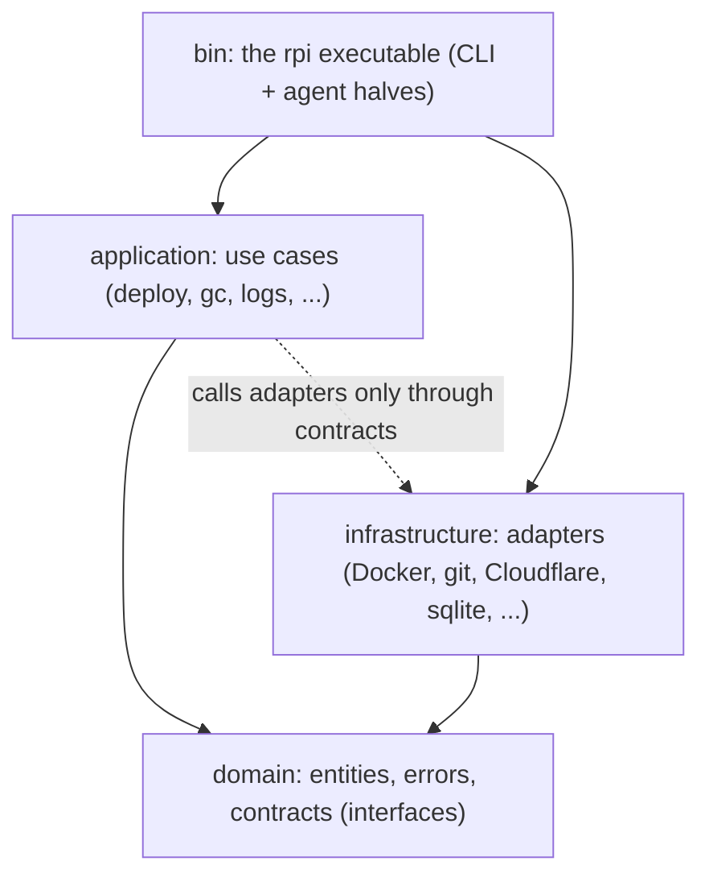

Request path (starting shape):

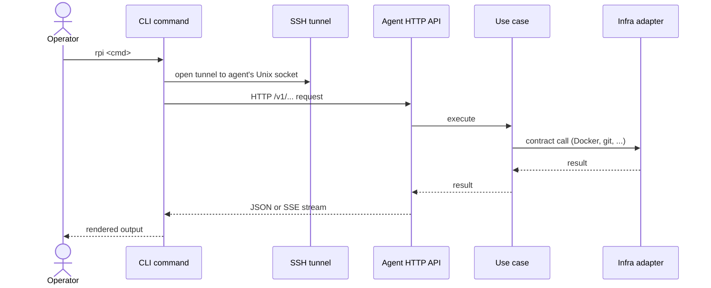

Walkthrough must cover: the dependency rule (inner layers know nothing about outer ones), why contracts exist (swappable/testable adapters — in plain words, no trait jargon), which commands skip the agent entirely (local-only: `init`, `setup`), and the failure branch "agent lacks a route → CLI explains the agent is older". `Source anchors`: the five code files read (the `add-cli-command` skill is context, not an anchor).

- [ ] **Step 3: Verify** — checklist + anchors cross-check.

- [ ] **Step 4: Commit**

```bash
rtk git add docs/architecture/crates.md
rtk git commit -m "docs(architecture): add crate layering and request path

Co-Authored-By: Claude Fable 5 <noreply@anthropic.com>"
```

---

### Task 4: `docs/architecture/storage.md`

**Files:**
- Create: `docs/architecture/storage.md`
- Read first: `crates/infrastructure/src/sqlite.rs` (tables), `crates/infrastructure/src/history.rs`, `crates/infrastructure/src/migrations.rs` (what migrates), `crates/infrastructure/src/secretsfile.rs`, `crates/infrastructure/src/secretpath.rs`, `crates/bin/src/agent/config.rs` (config path + keys), `crates/bin/src/agent/state.rs` (data dir layout), `crates/bin/src/agent/setup.rs` (dirs/users created), `dev/agent.toml`

**Interfaces:**
- Consumes: template + style rules from Task 1's skill.
- Produces: `docs/architecture/storage.md`, referenced by `flows/secrets.md` and `flows/gc.md` readers for "where things live".

- [ ] **Step 1: Read the sources** (extract: every path the agent reads/writes on the Pi, who owns it, what's inside)

- [ ] **Step 2: Write the doc**

One flowchart mapping on-Pi locations (starting shape — take exact paths from `setup.rs`/`config.rs`/`state.rs`, do not trust this sketch):

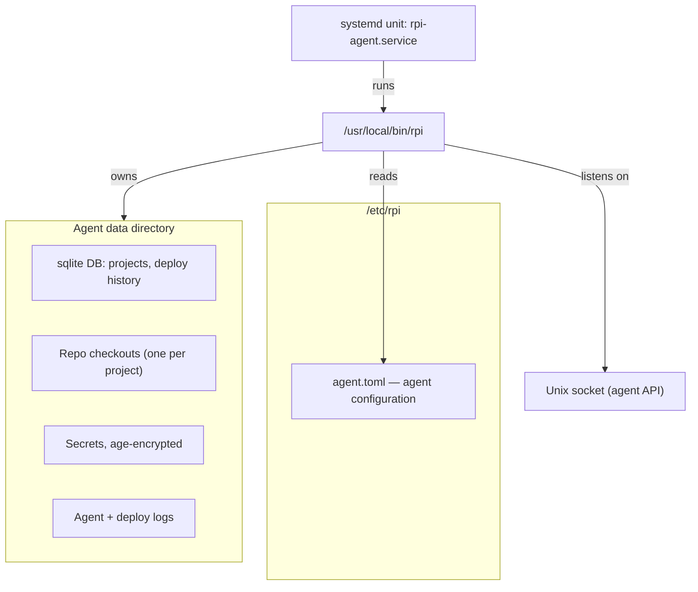

Walkthrough must cover: which user owns what (root-owned binary/unit vs unprivileged `rpi-agent` data), what is in the sqlite DB vs on plain disk, where secrets sit at rest vs at deploy time (0600 into checkout — pointer to `flows/secrets.md`), and what survives an agent update vs a reinstall. `Source anchors`: the nine files read.

- [ ] **Step 3: Verify** — checklist + anchors cross-check.

- [ ] **Step 4: Commit**

```bash
rtk git add docs/architecture/storage.md
rtk git commit -m "docs(architecture): add on-Pi storage layout

Co-Authored-By: Claude Fable 5 <noreply@anthropic.com>"
```

---

### Task 5: `docs/architecture/flows/deploy.md`

**Files:**
- Create: `docs/architecture/flows/deploy.md`
- Read first: `crates/application/src/deploy.rs` (stage order — the core file, read closely), `crates/application/src/scheduler.rs` (queue semantics), `crates/infrastructure/src/git.rs`, `crates/infrastructure/src/repo.rs`, `crates/infrastructure/src/docker.rs` (build/up roles only), `crates/infrastructure/src/health.rs`, `crates/infrastructure/src/probe.rs`, `crates/infrastructure/src/hostnet.rs` (stable ports), `crates/infrastructure/src/overrides.rs` (compose override), `crates/bin/src/cli/commands.rs` (the `deploy` fn — client side + SSE consumption)

**Interfaces:**
- Consumes: template + style rules from Task 1's skill; layering context from Task 3.
- Produces: `docs/architecture/flows/deploy.md` — the central flow doc.

- [ ] **Step 1: Read the sources** (extract: exact stage names and order, what each stage does and how it fails, queue rules: latest-wins, `--cancel`, supersede)

- [ ] **Step 2: Write the doc**

Two diagrams. Pipeline sequence (starting shape — verify stage list `fetch → build → start → health → route → gc` against `deploy.rs`):

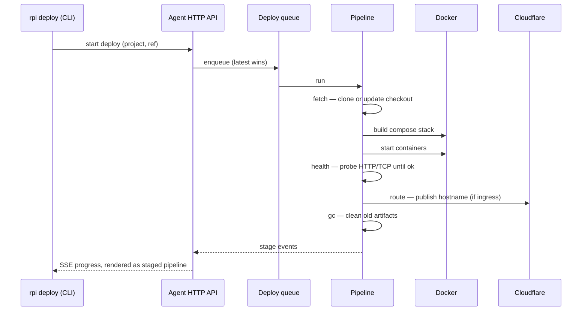

Queue lifecycle (verify states against `scheduler.rs`):

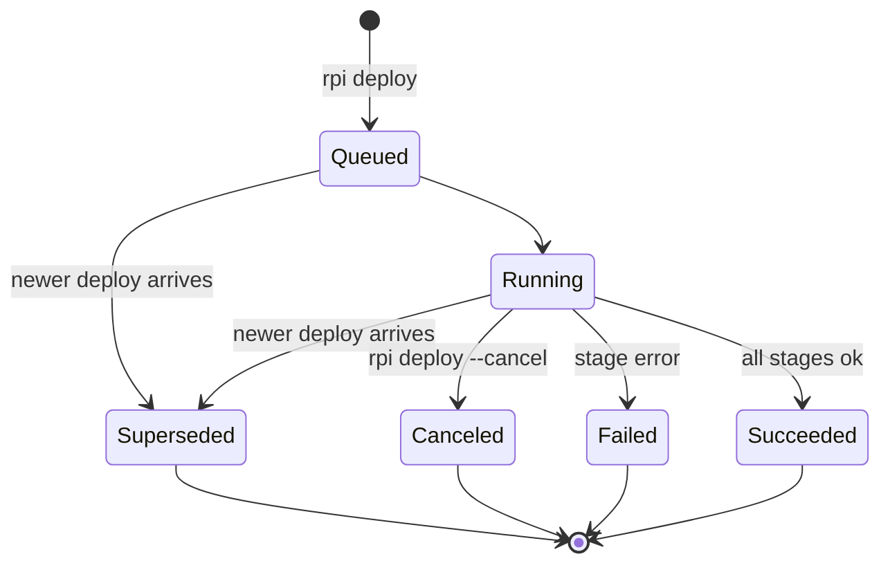

Walkthrough must cover: each stage in one numbered step (plain words), the failure branch per stage (what the CLI shows), latest-wins semantics, and what happens to the running containers when a deploy fails mid-way. `Source anchors`: the ten files read.

- [ ] **Step 3: Verify** — checklist + anchors cross-check.

- [ ] **Step 4: Commit**

```bash
rtk git add docs/architecture/flows/deploy.md
rtk git commit -m "docs(architecture): add deploy pipeline and queue flow

Co-Authored-By: Claude Fable 5 <noreply@anthropic.com>"
```

---

### Task 6: `docs/architecture/flows/connect.md`

**Files:**
- Create: `docs/architecture/flows/connect.md`
- Read first: `crates/bin/src/cli/config.rs` (profiles, `PI_SERVER`, `PI_AGENT_URL`), `crates/bin/src/cli/connect.rs`, `crates/bin/src/cli/ssh.rs`, `crates/bin/src/cli/tunnel.rs`, `crates/bin/src/cli/api.rs` (error extraction + old-agent 404 handling), `crates/bin/src/compat.rs` (handshake, feature gating, skew banner)

**Interfaces:**
- Consumes: template + style rules from Task 1's skill.
- Produces: `docs/architecture/flows/connect.md` — referenced by every remote-command explanation.

- [ ] **Step 1: Read the sources** (extract: profile resolution order, tunnel mechanics, handshake contents, what happens on version skew both directions)

- [ ] **Step 2: Write the doc**

One sequence diagram (starting shape):

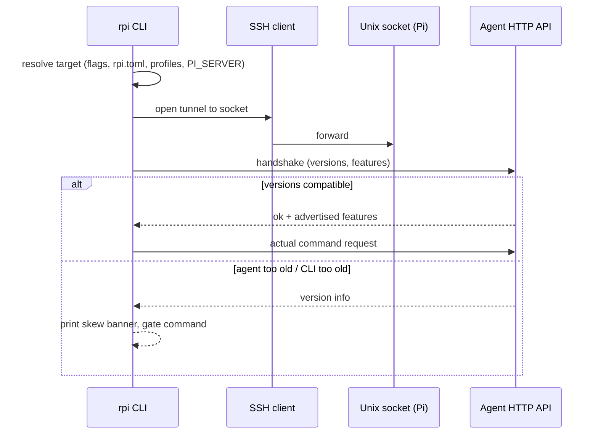

Walkthrough must cover: every resolution source for "which Pi" in priority order, why a Unix socket (nothing but SSH exposed), what the handshake exchanges, feature gating (command refused with a clear message instead of a confusing error), and failure branches: SSH refused, socket missing (agent not running), bare 404 from an old agent. `Source anchors`: the six files read.

- [ ] **Step 3: Verify** — checklist + anchors cross-check.

- [ ] **Step 4: Commit**

```bash
rtk git add docs/architecture/flows/connect.md
rtk git commit -m "docs(architecture): add connect and version-compat flow

Co-Authored-By: Claude Fable 5 <noreply@anthropic.com>"
```

---

### Task 7: `docs/architecture/flows/secrets.md`

**Files:**
- Create: `docs/architecture/flows/secrets.md`
- Read first: `crates/application/src/secrets.rs`, `crates/application/src/mask.rs`, `crates/infrastructure/src/secrets.rs` (encryption), `crates/infrastructure/src/secretsfile.rs` (at-rest storage), `crates/infrastructure/src/secretpath.rs` (path validation), `crates/infrastructure/src/dotenv.rs`, `crates/application/src/deploy.rs` (only the secret-injection point)

**Interfaces:**
- Consumes: template + style rules from Task 1's skill; storage locations from Task 4.
- Produces: `docs/architecture/flows/secrets.md`.

- [ ] **Step 1: Read the sources** (extract: what `rpi secrets send` transmits and how it's protected in transit and at rest, how deploy injects, how masking works in logs)

- [ ] **Step 2: Write the doc**

One sequence diagram (starting shape — verify where encryption happens against the code):

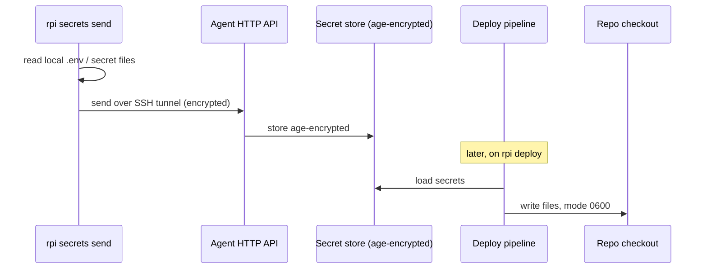

Walkthrough must cover: which files can be secrets (.env plus arbitrary files), the two protection layers (SSH transport + age at rest), exact moment of decryption, masking of secret values in logs/output, and failure branches: sending to a project that doesn't exist, deploy without secrets sent, path traversal rejected. `Source anchors`: the seven files read.

- [ ] **Step 3: Verify** — checklist + anchors cross-check.

- [ ] **Step 4: Commit**

```bash
rtk git add docs/architecture/flows/secrets.md
rtk git commit -m "docs(architecture): add secrets lifecycle flow

Co-Authored-By: Claude Fable 5 <noreply@anthropic.com>"
```

---

### Task 8: `docs/architecture/flows/ingress.md`

**Files:**
- Create: `docs/architecture/flows/ingress.md`
- Read first: `crates/infrastructure/src/cloudflare.rs` (API calls: tunnel, DNS), `crates/infrastructure/src/cloudflared.rs` (install, config.yml, adoption), `crates/infrastructure/src/hostnet.rs` (stable host port), `crates/infrastructure/src/overrides.rs` (compose override incl. restart policy), `plugins/rpi/skills/rpi-toml/SKILL.md` (the `[ingress]` section contract)

**Interfaces:**
- Consumes: template + style rules from Task 1's skill; deploy `route` stage context from Task 5.
- Produces: `docs/architecture/flows/ingress.md`.

- [ ] **Step 1: Read the sources** (extract: create-vs-adopt logic for existing tunnels, config.yml handling, DNS record management, traffic path, stable port allocation)

- [ ] **Step 2: Write the doc**

Two diagrams: setup sequence and traffic path. Setup (starting shape):

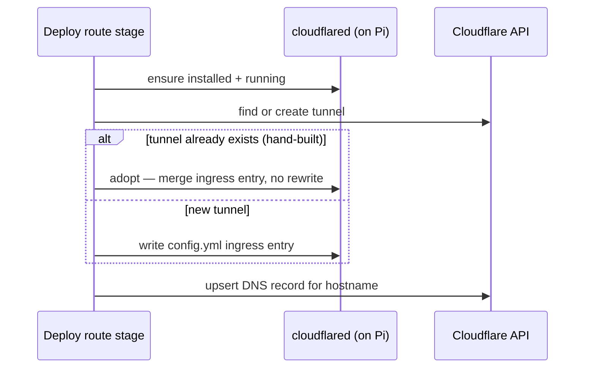

Traffic path (flowchart): end user → Cloudflare edge → outbound tunnel → cloudflared on Pi → stable host port → container. Walkthrough must cover: why adoption exists (no downtime for hand-built tunnels), where the stable host port comes from and why compose must not pin ports, restart policy pinned via override, and failure branches: missing Cloudflare token, hostname already routed elsewhere, cloudflared not running. `Source anchors`: the four code files read (the rpi-toml skill is context, not an anchor).

- [ ] **Step 3: Verify** — checklist + anchors cross-check.

- [ ] **Step 4: Commit**

```bash
rtk git add docs/architecture/flows/ingress.md
rtk git commit -m "docs(architecture): add Cloudflare ingress flow

Co-Authored-By: Claude Fable 5 <noreply@anthropic.com>"
```

---

### Task 9: `docs/architecture/flows/agent-setup.md` + `flows/agent-update.md`

**Files:**
- Create: `docs/architecture/flows/agent-setup.md`, `docs/architecture/flows/agent-update.md`
- Read first: `crates/bin/src/agent/setup.rs`, `crates/bin/src/agent/self_install.rs`, `scripts/install.sh`, `scripts/postinstall.js`, `bin/rpi.js`, `crates/bin/src/agent/update.rs`, `crates/bin/src/agent/release.rs`, `crates/bin/src/cli/upgrade.rs`, `docs/superpowers/specs/2026-07-13-rpi-remote-agent-update-design.md` (trust model — background reading)

**Interfaces:**
- Consumes: template + style rules from Task 1's skill; storage/ownership facts from Task 4.
- Produces: both docs; they cross-reference each other (setup establishes the trust boundary update reuses).

- [ ] **Step 1: Read the sources** (extract: what `sudo rpi agent setup` creates and why root is needed, how install paths differ npm vs install.sh, how `rpi upgrade` reaches the board, where SHA256 verification happens, what restarts)

- [ ] **Step 2: Write `agent-setup.md`**

Sequence diagram (starting shape): operator runs install (npm postinstall downloads checksum-verified prebuilt binary, or `install.sh` does the same without npm) → `sudo rpi agent setup` → creates `rpi-agent` user (docker group, no sudo) + dirs → self-installs binary to `/usr/local/bin/rpi` → writes + starts the systemd unit. Walkthrough must cover: the privilege split (root does the one-time setup; the agent then runs unprivileged), config adoption on re-run (existing `agent.toml`/tunnel config preserved), and failure branches: missing Docker, unsupported platform (source-build fallback), re-running setup on a configured host. `Source anchors`: `setup.rs`, `self_install.rs`, `install.sh`, `postinstall.js`, `rpi.js`.

- [ ] **Step 3: Write `agent-update.md`**

Sequence diagram (starting shape — verify the actual mechanism in `upgrade.rs`/`update.rs` closely; the privileged swap runs over SSH, not through the agent):

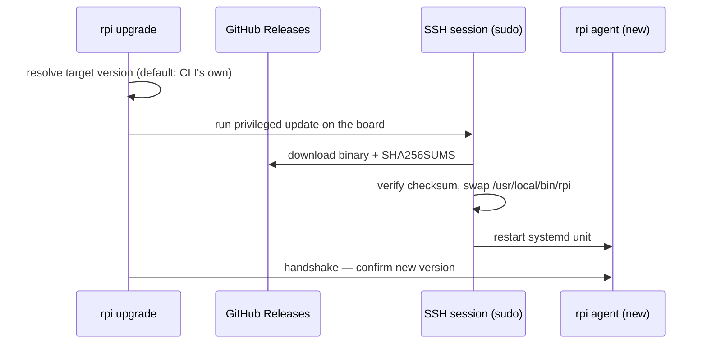

Walkthrough must cover: why the agent never updates itself (unprivileged by design), the unchanged trust root (SSH + sudo + TLS + SHA256), and failure branches: checksum mismatch, target version has no release asset, agent fails to come back after restart. `Source anchors`: `update.rs`, `release.rs`, `upgrade.rs`.

- [ ] **Step 4: Verify both docs** — checklist + anchors cross-check.

- [ ] **Step 5: Commit**

```bash
rtk git add docs/architecture/flows/agent-setup.md docs/architecture/flows/agent-update.md
rtk git commit -m "docs(architecture): add agent setup and update flows

Co-Authored-By: Claude Fable 5 <noreply@anthropic.com>"
```

---

### Task 10: `docs/architecture/flows/commands.md` + `flows/observability.md`

**Files:**
- Create: `docs/architecture/flows/commands.md`, `docs/architecture/flows/observability.md`
- Read first: `crates/application/src/command.rs`, `crates/bin/src/cli/sse.rs`, `crates/application/src/logs.rs`, `crates/application/src/tail.rs`, `crates/application/src/stats.rs`, `crates/application/src/diagnostics.rs`, `crates/infrastructure/src/metrics.rs`, `crates/infrastructure/src/sys.rs`, `crates/infrastructure/src/events.rs`, `crates/bin/src/agent/logfile.rs`, `crates/bin/src/cli/stats_view.rs` (rendering role only)

**Interfaces:**
- Consumes: template + style rules from Task 1's skill; request-path context from Task 3.
- Produces: both docs.

- [ ] **Step 1: Read the sources** (extract: how a declared `[commands]` entry becomes an exec inside the container and how output streams back; how logs/stats/doctor each gather data and ship it to the terminal, including the `-w` live mode)

- [ ] **Step 2: Write `commands.md`**

Sequence diagram (starting shape): `rpi command <name>` → CLI reads `[commands]` from `rpi.toml` → request to agent → agent execs inside the service container → log lines stream back as SSE events → terminal exit code mirrors the command. Walkthrough must cover: where commands are declared, which container they run in, streaming semantics, and failure branches: unknown command name, service not running, non-zero exit. `Source anchors`: `command.rs`, `sse.rs`.

- [ ] **Step 3: Write `observability.md`**

One sequence diagram with three short phases (or three small diagrams if clearer — author's call within the node cap): logs (follow container/agent logs to the terminal), stats (metrics snapshot; `-w` = repeated polling driving the TUI dashboard), doctor (agent-side checks reported as PASS/FAIL). Walkthrough must cover: data origin for each (Docker vs system vs agent state), what `-w` changes, and failure branches: project unknown, agent lacking a newer stats feature (skew gate). `Source anchors`: `logs.rs`, `tail.rs`, `stats.rs`, `diagnostics.rs`, `metrics.rs`, `sys.rs`, `events.rs`, `logfile.rs`, `stats_view.rs`.

- [ ] **Step 4: Verify both docs** — checklist + anchors cross-check.

- [ ] **Step 5: Commit**

```bash
rtk git add docs/architecture/flows/commands.md docs/architecture/flows/observability.md
rtk git commit -m "docs(architecture): add commands and observability flows

Co-Authored-By: Claude Fable 5 <noreply@anthropic.com>"
```

---

### Task 11: `docs/architecture/flows/gc.md`

**Files:**
- Create: `docs/architecture/flows/gc.md`
- Read first: `crates/application/src/gc.rs`, `crates/infrastructure/src/disk.rs`, `crates/infrastructure/src/history.rs`, `crates/infrastructure/src/docker.rs` (prune role only)

**Interfaces:**
- Consumes: template + style rules from Task 1's skill; storage layout from Task 4.
- Produces: `docs/architecture/flows/gc.md`.

- [ ] **Step 1: Read the sources** (extract: what triggers gc — post-deploy stage vs manual `rpi gc`; what is removed and what retention rules apply; what is never touched)

- [ ] **Step 2: Write the doc**

One flowchart (starting shape — derive the actual cleanup targets from `gc.rs`):

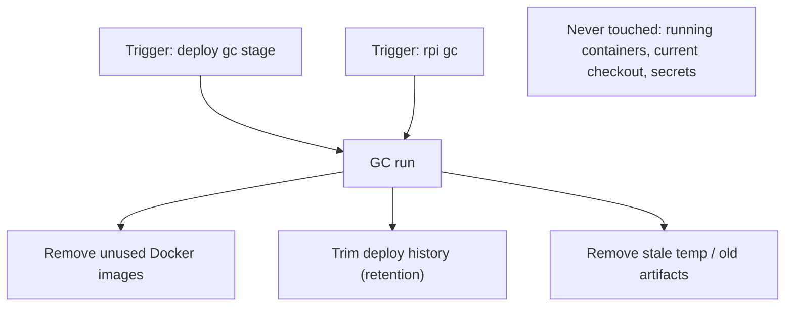

Walkthrough must cover: both triggers, each cleanup target with its retention rule, what is explicitly preserved, and the failure branch: gc error does not fail a successful deploy (verify this in code — adjust if untrue). `Source anchors`: the four files read.

- [ ] **Step 3: Verify** — checklist + anchors cross-check.

- [ ] **Step 4: Commit**

```bash
rtk git add docs/architecture/flows/gc.md
rtk git commit -m "docs(architecture): add gc flow

Co-Authored-By: Claude Fable 5 <noreply@anthropic.com>"
```

---

### Task 12: `docs/architecture/README.md` (index)

**Files:**
- Create: `docs/architecture/README.md`
- Read first: every doc created in Tasks 2–11 (titles + first paragraphs only)

**Interfaces:**
- Consumes: all 12 documents from Tasks 2–11.
- Produces: the entry point the repo README could later link to; completes the 13-document set.

- [ ] **Step 1: Write the index**

Structure (fill the one-liners from each doc's actual first paragraph — do not invent):

```markdown
# Architecture

Diagrams explaining how rpi is built and how its processes flow, written for
a reader who does not read Rust. Maintained under the rules in the
`architecture-diagrams` skill (`.claude/skills/architecture-diagrams/SKILL.md`);
kept honest by the `architecture-audit` skill.

## Reading order

Start with the three system documents, then dip into flows as needed.

1. [overview.md](overview.md) — <one-liner>
2. [crates.md](crates.md) — <one-liner>
3. [storage.md](storage.md) — <one-liner>

## Process flows

| Flow | Answers |
|---|---|
| [deploy](flows/deploy.md) — <one-liner> | what happens on `rpi deploy` |
| [connect](flows/connect.md) — <one-liner> | how the CLI reaches the Pi |
| [secrets](flows/secrets.md) — <one-liner> | `rpi secrets send` and injection |
| [ingress](flows/ingress.md) — <one-liner> | publishing to the internet |
| [agent-setup](flows/agent-setup.md) — <one-liner> | bootstrapping a board |
| [agent-update](flows/agent-update.md) — <one-liner> | `rpi upgrade` |
| [commands](flows/commands.md) — <one-liner> | `rpi command <name>` |
| [observability](flows/observability.md) — <one-liner> | logs / stats / doctor |
| [gc](flows/gc.md) — <one-liner> | what gets cleaned, when |
```

No `Source anchors` section — the index describes docs, not code. (This is the one deliberate template exception; note it in the file with a single sentence.)

- [ ] **Step 2: Verify** — every relative link resolves to an existing file; every doc from Tasks 2–11 is listed exactly once.

- [ ] **Step 3: Commit**

```bash
rtk git add docs/architecture/README.md
rtk git commit -m "docs(architecture): add index with reading order

Co-Authored-By: Claude Fable 5 <noreply@anthropic.com>"
```

---

### Task 13: `architecture-audit` skill

**Files:**
- Create: `.claude/skills/architecture-audit/SKILL.md`

**Interfaces:**
- Consumes: doc template + map from Task 1's skill (referenced by name).
- Produces: the audit procedure Task 15 executes verbatim.

- [ ] **Step 1: Write the skill file**

Write `.claude/skills/architecture-audit/SKILL.md` with exactly this content:

````markdown
---
name: architecture-audit
description: Use when asked to check, sync, or audit docs/architecture/ against the code — verifies every diagram and walkthrough against its Source anchors and fixes drift.
---

# Architecture Audit

Full sweep of `docs/architecture/` against the code. The outcome is fixed
docs, not a report of suggestions. Conventions and the code-area→doc map
live in the `architecture-diagrams` skill — read it first.

## Procedure

1. **Inventory.** List every `.md` under `docs/architecture/` (including
   `flows/`). `README.md` is checked for link integrity and listing
   completeness only (it deliberately has no anchors).
2. **Per document:**
   - Read its `Source anchors`. Anchor pointing at a missing file → drift.
   - Read every anchored file. Compare against the diagram AND the prose
     walkthrough: stage names/order, participants, states, failure branches.
   - Fix any mismatch by editing the doc (diagram, walkthrough, and anchors
     together — all three must stay consistent). Follow the template and
     Mermaid style rules from `architecture-diagrams`.
3. **Orphan check, both directions:**
   - Docs → code: anchors referencing deleted/renamed files.
   - Code → docs: rows of the code-area→doc map in `architecture-diagrams`
     whose code area has files not reflected in the mapped doc; plus new
     modules under `crates/*/src/` and new `cli/`/`agent/` files matching no
     map row at all. A genuinely new area may need a new `flows/<name>.md`
     — create it from the template, and add a map row to
     `architecture-diagrams` in the same change.
4. **Report.** One list: `doc — what drifted — what was changed`. If nothing
   drifted, say "zero drift" explicitly.
5. **Commit** doc fixes as `docs(architecture): sync <doc> with code` (one
   commit for the sweep is fine).

## What counts as drift

- Diagram or walkthrough contradicts current code behavior.
- Anchor list stale (missing files that shaped the doc; listing dead paths).
- Walkthrough failure branches that no longer exist (or new prominent ones
  missing).
- README index missing a doc or linking a dead file.

Cosmetic differences (wording, layout) are not drift — do not churn docs.
````

- [ ] **Step 2: Verify skill file conventions** — frontmatter shape as in Task 1 Step 2.

- [ ] **Step 3: Commit**

```bash
rtk git add .claude/skills/architecture-audit/SKILL.md
rtk git commit -m "chore(skills): add architecture-audit skill

Co-Authored-By: Claude Fable 5 <noreply@anthropic.com>"
```

---

### Task 14: CLAUDE.md rule

**Files:**
- Modify: `CLAUDE.md` (repo root)

**Interfaces:**
- Consumes: skill name `architecture-diagrams` from Task 1.
- Produces: the always-loaded rule that makes doc updates part of every task.

- [ ] **Step 1: Add the rule**

In root `CLAUDE.md`, section "Before finishing any task", after the paragraph about `cargo fmt`, append:

```markdown
If the change alters behavior or structure covered by `docs/architecture/`,
update the affected documents before finishing — see the
`architecture-diagrams` skill for the code-area→doc map and conventions.
```

- [ ] **Step 2: Verify** — read the section back; the new rule is inside "Before finishing any task", matches the register of the fmt/clippy/test items, and names the skill exactly `architecture-diagrams`.

- [ ] **Step 3: Commit**

```bash
rtk git add CLAUDE.md
rtk git commit -m "docs(claude): require architecture doc updates before finishing tasks

Co-Authored-By: Claude Fable 5 <noreply@anthropic.com>"
```

---

### Task 15: Acceptance — run the audit, expect zero drift

**Files:**
- Modify: any doc under `docs/architecture/` where drift is found (expected: none)

**Interfaces:**
- Consumes: the `architecture-audit` skill (Task 13) — execute its procedure verbatim; all 13 docs (Tasks 2–12).
- Produces: the spec's acceptance evidence.

- [ ] **Step 1: Execute the `architecture-audit` procedure end-to-end** — inventory, per-doc anchor comparison, both orphan checks, report.

- [ ] **Step 2: Evaluate the outcome**

Expected: "zero drift". Since the docs were just written, any drift found is an authoring bug — fix the doc, and if the root cause is a wrong or missing map row / anchor convention, fix Task 1's skill too.

- [ ] **Step 3: Commit fixes (only if drift was found)**

```bash
rtk git add docs/architecture .claude/skills/architecture-diagrams/SKILL.md
rtk git commit -m "docs(architecture): fix drift found by initial audit

Co-Authored-By: Claude Fable 5 <noreply@anthropic.com>"
```

- [ ] **Step 4: Final check against the spec's Acceptance section**

- All 13 documents exist: `README.md`, `overview.md`, `crates.md`, `storage.md` + 9 files in `flows/`.
- Every diagram passed the syntax checklist.
- Audit ran and reported zero drift (after fixes, if any).
- Both skills and the CLAUDE.md rule are committed.
