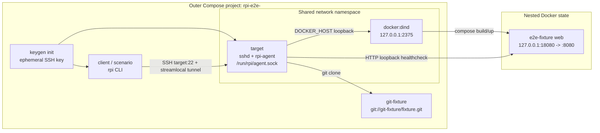

# Docker Production-Path E2E Deploy — Design

Date: 2026-07-10  
Status: approved

## 1. Context

`rpi-deploy` already has broad unit and in-process integration coverage, but its
real deployment boundary is still checked manually. The missing path is the one
that matters in production:

1. the CLI runs on a developer/CI machine;
2. it opens an SSH tunnel to `/run/rpi/agent.sock`;
3. the agent clones a Git repository;
4. the agent invokes Docker Compose;
5. the deployed service becomes reachable on the agent's allocated host port;
6. the CLI streams deployment progress and reports the final status.

The existing dev path through `PI_AGENT_URL` bypasses SSH and the Unix socket,
while application tests mock `ContainerRuntime`. Neither catches regressions in
SSH forwarding, socket permissions, real `docker compose` argument chains,
host-port allocation, Compose builds, or loopback health checks.

## 2. Goal and success criterion

Add a repeatable end-to-end merge gate that runs from one Docker container into
an isolated target environment and exercises the production CLI-to-agent path.
The same command must work on GitHub-hosted Ubuntu runners and locally through
Docker Desktop using Linux containers:

```text
npm run test:e2e
```

The test passes only when the current checkout's `rpi` binary:

- connects from a client container to a target over real OpenSSH;
- tunnels HTTP to the agent's real Unix socket;
- deploys a local Git fixture through the real agent and Docker Compose runtime;
- streams the meaningful fetch/build/up/health milestones and exits successfully;
- exposes the fixture on the stable allocated port `18080` and serves
  `GET /health` with HTTP 200;
- repeats the deploy successfully while preserving port `18080`;
- removes the project with `rpi rm --yes` and leaves no nested project
  containers behind;
- tears down every outer test container, network, and volume on both success and
  failure.

## 3. Scope

### Included

- Current source checkout, compiled into one Linux e2e runtime image.
- Real `rpi deploy`, `rpi ls`, and `rpi rm` CLI processes.
- Real OpenSSH client/server, host-key verification, local port forwarding, and
  Unix-socket forwarding.
- Real `rpi agent run` with SQLite state, filesystem workdirs, Compose overrides,
  port allocation, Git fetch, SSE deployment logs, and HTTP health gating.
- Real Docker Compose build/up/down against an isolated Docker-in-Docker daemon.
- A repository-local Git server and deterministic web fixture.
- A cross-platform Node launcher with deterministic teardown and diagnostics.
- An Ubuntu GitHub Actions merge gate on every pull request and push to `master`.
- Fast launcher unit tests on both Linux and Windows.

### Explicitly out of scope

- `rpi agent setup`, systemd units, host user creation, and Docker group setup.
- Cloudflare Tunnel and public ingress.
- Raspberry Pi ARM hardware and aarch64 release artifacts.
- External GitHub repositories, private repository deploy keys, and network
  credentials.
- `rpi secrets`, `rpi command`, logs/stats, and lifecycle command matrices.
- Failure-path deployments such as a deliberately broken healthcheck.
- Running the privileged e2e job on a self-hosted CI runner.

Those are separate follow-on suites. The first merge gate remains one complete,
stable happy path.

## 4. Chosen approach

Use a Docker Compose harness whose terminal `client` service runs the scenario.
A small Node launcher starts the harness, preserves its exit status, collects
diagnostics, and performs unconditional teardown.

This is preferred over a Rust integration test or Testcontainers because the
Compose file is both executable documentation and the most transparent place to
express a privileged DinD service, readiness dependencies, ephemeral volumes,
and the shared network namespace required by the current agent.

## 5. Architecture



### 5.1 Why `target` and DinD share a network namespace

The agent writes a Compose override that binds the allocated port to
`127.0.0.1`, then `HybridHealthGate` probes
`http://127.0.0.1:<allocated-port>`. A normal remote DinD service would publish
that port inside the DinD container while the agent probed a different
loopback, so every deployment would time out.

The outer Compose file therefore gives `target`:

```yaml
network_mode: service:dind
```

The `dind` service owns the outer network attachment and receives the network
alias `target`. OpenSSH in the target process namespace listens on port 22 of
that shared namespace, so the client still connects to host `target`. The Docker
daemon listens only on `127.0.0.1:2375`, and the target uses
`DOCKER_HOST=tcp://127.0.0.1:2375`.

The two services share networking only. Their processes and filesystems remain
separate. The target owns `/run/rpi/agent.sock`, `/var/lib/rpi`, and its agent
logs; DinD owns the nested Docker state.

### 5.2 Outer network exposure

The harness publishes no ports to the developer machine or GitHub runner.
Within the isolated outer network:

- `target` resolves to the DinD network namespace and exposes only SSH to the
  client;
- the DinD TCP API is loopback-only and is not reachable from the client;
- the deployed application's port is loopback-only and is verified by an SSH
  command executed inside the target namespace;
- `git-fixture` exposes the unauthenticated Git protocol only to the test
  network.

## 6. Components

### 6.1 E2E runtime image

One multi-stage Dockerfile builds the current checkout with
`cargo build --locked -p pi` and copies `target/debug/rpi` into a Debian-based
Linux runtime image. Debug profile is intentional: this suite verifies behavior,
not release optimization or musl packaging, and must remain viable as a PR gate.

The runtime image contains only the test tooling shared by the client, target,
and Git fixture roles: OpenSSH client/server, Git including `git daemon`, curl,
the Docker CLI with Compose v2, and basic POSIX utilities. Client and target use
the exact same `rpi` binary layer, so a version mismatch cannot be hidden by the
harness.

### 6.2 `dind`

- Uses a pinned official `docker:dind` image.
- Is the only outer service with `privileged: true`.
- Uses an ephemeral data volume.
- Disables DinD TLS only because the TCP listener is bound to shared loopback,
  never `0.0.0.0` and never a host-published port.
- Becomes healthy only after `docker info` succeeds.

No `/var/run/docker.sock` from Docker Desktop or the GitHub runner is mounted
into any container.

### 6.3 `target`

The target image pre-creates two accounts:

- `rpi-agent`, which owns `/var/lib/rpi`, `/var/log/rpi`, and the Unix socket;
- `deploy`, an SSH login user that belongs to the `rpi-agent` group.

At startup the target:

1. creates SSH host keys;
2. installs the run-scoped public key as `deploy`'s `authorized_keys`;
3. starts `rpi agent run --config /etc/rpi/agent.toml` as `rpi-agent`;
4. starts `sshd` in the foreground with password and root login disabled;
5. keeps agent and sshd output on container stdout/stderr for outer diagnostics.

The SSH server explicitly permits TCP and stream-local forwarding. The target
healthcheck succeeds only when all of the following pass:

- port 22 accepts connections;
- `curl --unix-socket /run/rpi/agent.sock http://localhost/v1/version` succeeds;
- `docker info` succeeds through `DOCKER_HOST`.

Agent configuration uses the Unix socket, an isolated data directory, port range
`18080-18089`, fetch timeout 60 seconds, build timeout 5 minutes, up timeout 60
seconds, and no Cloudflare configuration.

### 6.4 Run-scoped SSH material

A one-shot `keygen` service writes a fresh Ed25519 keypair into an ephemeral
named volume. The client mounts the private key read-only and enforces mode 0600;
the target consumes only the public key. No test private key is committed or
embedded in an image layer.

After target readiness, the client records the target host key in its temporary
`~/.ssh/known_hosts`. This is required because the production CLI invokes the
system `ssh` command without disabling strict host-key checking.

### 6.5 Git fixture

`git-fixture` initializes a bare repository from versioned files under
`tests/e2e/fixtures/app`, creates branch `main`, and serves it through
`git daemon` on the outer test network. Its healthcheck uses `git ls-remote`.

The fixture's `rpi.toml` declares:

- project name `e2e-fixture`;
- source `git://git-fixture/fixture.git`, branch `main`;
- Compose service `web`, container port `8080`;
- `GET /health`, expected status `200`, timeout 30 seconds;
- no hostname, secrets, commands, fixed host port, or LAN exposure.

The fixture Compose project builds a minimal BusyBox HTTP service that serves a
file named `health` containing `ok`. It deliberately has no Dockerfile
`HEALTHCHECK`, forcing `HybridHealthGate` to exercise its HTTP probe through the
allocated host port rather than short-circuiting on Docker health state.

### 6.6 Client scenario

The `client` service depends on successful key generation and healthy DinD,
target, and Git services. It runs a strict POSIX shell scenario with
`set -eu` and pipeline failure propagation. It sets `NO_COLOR=1` so assertions
operate on stable semantic text, not ANSI presentation.

The scenario uses only normal CLI flags; `PI_AGENT_URL` is unset throughout.

### 6.7 Host launcher

`tests/e2e/run.mjs` is the only host-side orchestrator. It uses Node's process
API without a shell so argument quoting works identically on Windows and Linux.
It:

- validates Docker and Docker Compose availability and the supported Compose
  version;
- generates a collision-resistant `COMPOSE_PROJECT_NAME` prefixed with
  `rpi-e2e-`;
- runs `docker compose config --quiet` before starting;
- starts the harness with `--abort-on-container-exit` and
  `--exit-code-from client`;
- enforces a total scenario deadline and handles Ctrl+C/termination;
- collects diagnostics before teardown on any non-zero result;
- always runs `docker compose down -v --remove-orphans` in a `finally` path;
- returns the scenario's original exit code, even if diagnostics or cleanup
  encounter a second error.

The default local artifact directory is
`target/e2e-artifacts/<run-id>`. CI overrides it with a directory under
`${{ runner.temp }}`.

## 7. Execution and assertions

The client scenario performs these steps in order:

1. Verify the current `rpi` binary runs and the target accepts key-only SSH.
2. Populate `known_hosts` with the target's run-scoped host key.
3. From the fixture checkout, run:

   ```text
   rpi deploy --host target --user deploy --key /run/e2e-keys/id_ed25519
   ```

4. Require exit code 0 and semantic log milestones for fetch, Compose build,
   Compose up, and `healthcheck: passed`. Do not snapshot the full themed CLI
   output.
5. Run `rpi ls` through the same SSH options. Require `e2e-fixture`, port
   `18080`, and a running `web` service in the output.
6. Independently SSH to the target and require
   `curl -fsS http://127.0.0.1:18080/health` to return `ok`.
7. Run the identical deploy a second time. Require exit code 0, the same
   milestones, and `rpi ls` still reporting port `18080`.
8. Run:

   ```text
   rpi rm e2e-fixture --yes --host target --user deploy \
     --key /run/e2e-keys/id_ed25519
   ```

9. Require `rpi ls` to report no deployed projects, the loopback health request
   to fail, and nested Docker to contain no container with Compose project label
   `e2e-fixture`.

Assertions favor stable domain facts over formatting. The test may match
well-established milestone substrings, project names, ports, HTTP status/body,
and Docker labels; it must not depend on box-drawing characters, colors,
elapsed-time text, random deployment IDs, or full-table spacing.

## 8. Readiness, timeouts, and failure handling

Compose readiness conditions prevent the client from starting until its
dependencies are usable. Each service healthcheck has a bounded retry window of
at most 60 seconds. The fixture deploy has its tighter agent-side stage limits,
the client scenario has a 15-minute deadline after image construction, and the
GitHub job has `timeout-minutes: 30` as the final guard.

On scenario failure or timeout, and before `down`, the launcher records:

- `docker compose ps --all` and timestamped outer service logs;
- target agent and sshd output from the outer logs;
- nested `docker info`, `docker ps -a`, and `docker images` through the target;
- logs from every nested fixture container that still exists;
- the scenario output and primary exit code.

Diagnostic collection is best effort. An unavailable SSH server or Docker daemon
must not replace the original deploy error. Teardown is also best effort but
mandatory: its failure is reported separately while the original non-zero exit
status is preserved.

Unique Compose project names, no host-published ports, and per-run volumes make
concurrent runs independent. The nested fixed port `18080` is safe because each
run has its own DinD daemon and network namespace.

## 9. Security model

Privileged DinD is required by the official Docker-in-Docker model. The test
reduces its blast radius as follows:

- only `dind` is privileged;
- the host Docker socket is never mounted;
- the Docker TCP API is bound to shared loopback only;
- no outer or nested port is published to the host;
- all state and SSH credentials are run-scoped and removed with volumes;
- the Git repository and SSH identities are synthetic and contain no secrets;
- the GitHub job keeps `permissions: contents: read` and receives no deployment
  credentials;
- the workflow must remain on a GitHub-hosted disposable Ubuntu runner and must
  not be moved to `self-hosted` without a separate threat review;
- local execution is explicit through `npm run test:e2e` and prints a notice
  that a privileged DinD container will be started.

A pull request already executes repository-controlled code in CI. This design
does not widen access to repository or production secrets; it confines nested
Docker operations to an ephemeral hosted runner and isolated daemon.

## 10. Test layers

### 10.1 Launcher unit tests

Node unit tests inject a fake process runner and cover:

- project-name generation and Compose argument shape;
- preflight failure before startup;
- success followed by teardown;
- scenario failure followed by diagnostics and teardown;
- cleanup failure not masking the scenario exit code;
- timeout and signal paths requesting shutdown exactly once.

These tests join the existing Node test command and run in both Linux and
Windows CI jobs. They do not require Docker.

### 10.2 Compose validation

The launcher runs `docker compose config --quiet` as a preflight. CI treats an
invalid Compose graph or unresolved required variable as a test failure before
starting privileged services.

### 10.3 Full e2e

The full harness runs only in the Ubuntu e2e job and when invoked explicitly on
a developer machine. Existing Rust and Node suites remain fast and independent
of Docker.

## 11. GitHub Actions integration

Add a separate `e2e` job to `.github/workflows/ci.yml`:

- trigger coverage remains the workflow's existing pull requests and pushes to
  `master`;
- `runs-on: ubuntu-latest` and `needs: linux` avoid spending DinD time when the
  Linux format/lint/unit gate already failed;
- Node 22 is installed consistently with the existing jobs;
- Docker Buildx is initialized with current GitHub-hosted BuildKit support;
- the runtime image is prebuilt, loaded into the runner daemon, and cached with
  `cache-from: type=gha` and
  `cache-to: type=gha,mode=max,scope=rpi-e2e,ignore-error=true`;
- the cache is an optimization only; a cache miss or unavailable cache export
  cannot change test correctness;
- `RPI_E2E_PREBUILT=1` tells the launcher to use the loaded runtime image;
  local execution omits this variable and lets Compose build the identical
  Dockerfile using Docker Desktop's normal BuildKit cache;
- the job runs `npm run test:e2e` with `timeout-minutes: 30`;
- on `failure()`, the workflow uploads `${{ runner.temp }}/rpi-e2e` as a
  diagnostic artifact using the repository's current artifact-action major;
- job permissions stay `contents: read` and no secrets are referenced.

The Buildx setup must support the GitHub Actions cache service API v2. Current
GitHub-hosted runners plus the official Buildx setup action satisfy that
requirement; the job must not rely on legacy cache API v1.

## 12. Local developer experience

Requirements:

- Docker Desktop configured for Linux containers, or Docker Engine on Linux;
- Docker Compose v2.33.1 or newer;
- support for privileged Linux containers;
- Node.js 18 or newer, matching the package engine requirement;
- enough disk for the Rust runtime image and the nested BusyBox fixture image.

The single supported command is:

```text
npm run test:e2e
```

No global Rust toolchain, SSH daemon, Git server, or `rpi` installation is
required on the host. The first cold build downloads base images and Rust
dependencies; subsequent local runs reuse BuildKit cache.

## 13. Files to add or update

Add:

- `tests/e2e/compose.yaml`
- `tests/e2e/Dockerfile`
- `tests/e2e/agent.toml`
- `tests/e2e/run.mjs`
- `tests/e2e/run.test.mjs`
- `tests/e2e/scenario.sh`
- `tests/e2e/target-entrypoint.sh`
- `tests/e2e/git-entrypoint.sh`
- `tests/e2e/fixtures/app/rpi.toml`
- `tests/e2e/fixtures/app/compose.yaml`
- `tests/e2e/fixtures/app/Dockerfile`
- `tests/e2e/fixtures/app/health`
- a root `.dockerignore` scoped so the runtime build receives Cargo manifests
  and source but excludes `.git`, `target`, `.superpowers`, and local artifacts.

Update:

- `package.json` — add `test:node` if needed to centralize current Node tests,
  add the launcher unit test, and add `test:e2e`;
- `.github/workflows/ci.yml` — use the shared Node test command and add the e2e
  job;
- `README.md` — document local e2e requirements, command, privileged DinD
  warning, and scope;
- `docs/ci-github-actions.md` — document the new merge gate, cache behavior,
  diagnostics, and why it is forbidden on self-hosted runners;
- `.gitignore` — ignore `.superpowers/` visual-companion state. E2E artifacts
  live under the already ignored root `target/` directory.

No production Rust code or public wire/schema behavior is expected to change.
If implementation exposes a production-code change as necessary, it requires a
design revision before proceeding.

## 14. Acceptance criteria

The implementation is complete when all of the following are true:

1. `npm run test:e2e` passes on Docker Desktop with Linux containers and on a
   GitHub-hosted Ubuntu runner.
2. The scenario never sets `PI_AGENT_URL` and demonstrably uses SSH plus the
   agent Unix socket.
3. The current checkout's one binary is used by both client and target.
4. Fetch, real Compose build/up, HTTP health gating, `rpi ls`, stable redeploy,
   and `rpi rm` assertions all pass.
5. The app uses port `18080` on both deploys and answers `/health` with `ok`.
6. No fixture project container remains after `rpi rm`.
7. No outer `rpi-e2e-<run-id>` containers, networks, or volumes remain after a
   successful or failed launcher run.
8. A forced launcher-unit-test failure proves diagnostics run before cleanup and
   the original exit status is preserved.
9. Existing `cargo test --locked` and Node tests remain green on Linux and
   Windows.
10. CI runs the e2e job for every pull request and push to `master`, uploads
    diagnostics only on failure, and uses no secrets.
11. README and CI documentation explain the command, requirements, privilege
    boundary, and troubleshooting artifacts.

## 15. Follow-on work

Potential later suites, each requiring its own scoped design, are:

- broken healthcheck followed by recovery;
- encrypted environment and secret-file delivery;
- deployed `[commands]`, logs, stats, and lifecycle operations;
- private Git repository authentication;
- `rpi agent setup` inside a systemd-capable environment;
- aarch64 execution on real or emulated Raspberry Pi infrastructure.
